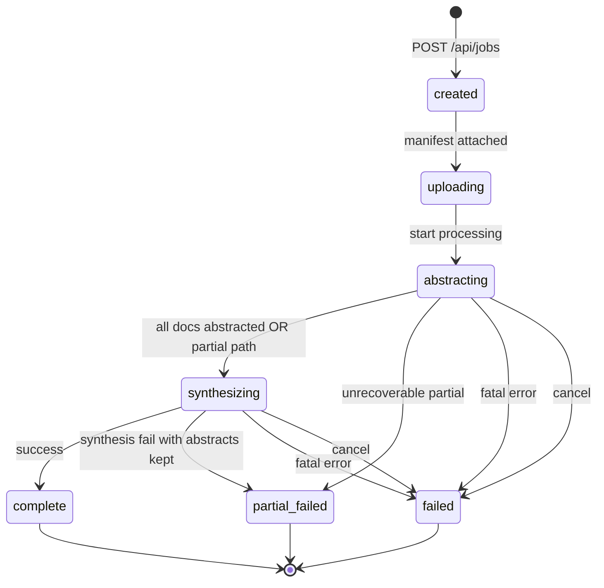

# Phase 1: Durable Job Architecture — Design Spec

**Project:** Mineral Title Analyzer (`title-analyzer`)  
**Scope:** Agent 1 — job metadata system and API contract (design only; no implementation in this phase)  
**Status:** Phase 1 design baseline for later implementation agents

---

## Context

**Current architecture:** Single-page client (`public/index.html`) orchestrates abstraction → synthesis; `api/analyze.js` proxies Anthropic with a 60s timeout and ~4.5 MB body limit. Progress and abstraction checkpoints live in **browser `localStorage` only** — no server-side job state.

Phase 1 defines the **metadata contract and API surface** later phases implement. It does **not** move PDFs, base64, or full title opinions into persistence.

---

## 1. Recommended storage

| Option | Fit for this repo | Verdict |
|--------|-------------------|---------|
| **In-memory only** | Matches today’s rate limiter pattern; breaks across Vercel instances and cold starts; no resume after tab close | Not durable |
| **JSON / file on disk** | Serverless FS is ephemeral; no shared state between invocations | Not viable on Vercel |
| **Vercel Postgres / Neon** | Strong for history, reporting, migrations; heavier ops for phase-1 metadata only | Defer unless history is required in phase 1 |
| **Vercel KV / Upstash Redis** | JSON documents by key, TTL, atomic counters, fits serverless | **Recommended** |

### Recommendation: Vercel KV (Upstash Redis)

**Rationale:**

- Repo has **no ORM, no DB, no build step** — KV adds one integration and env vars.
- Job + document records are **document-shaped JSON** with modest size if abstracts stay out of phase 1 (or live in separate keys with TTL).
- **TTL** (e.g. 7–30 days) supports privacy and storage bounds for courthouse-adjacent data.
- Later phases can add **Neon** for audit/history without breaking the API contract.

**Suggested key layout (phase 2+ implementation):**

```
job:{jobId}                    → Job JSON
job:{jobId}:docs               → Hash of documentId → Document JSON (or separate keys per doc)
job:{jobId}:secret             → lookup token hash (if using job secrets)
jobs:by-fingerprint:{fp}       → optional idempotency (phase 2+)
jobs:recent                    → capped list for GET /api/jobs (optional)
```

---

## 2. Job schema

### 2.1 `AnalysisJob` (top-level)

| Field | Type | Required | Notes |
|-------|------|----------|-------|
| `id` | `string` | yes | `job_` + UUID v4 (opaque, unguessable) |
| `status` | enum | yes | See §2.2 |
| `totalDocuments` | `integer` | yes | ≥ 0; set at manifest time |
| `completedDocuments` | `integer` | yes | Abstracted successfully |
| `failedDocuments` | `integer` | yes | Terminal per-doc failures |
| `currentPhase` | enum | yes | `upload` \| `abstract` \| `synthesize` \| `done` |
| `errorMessage` | `string \| null` | yes | Human-readable; set on `failed` / `partial_failed` |
| `errorCode` | `string \| null` | optional | Machine-readable: `rate_limit`, `cancelled`, `upstream_timeout`, etc. |
| `createdAt` | ISO-8601 | yes | |
| `updatedAt` | ISO-8601 | yes | |
| `completedAt` | ISO-8601 \| null | yes | Set when `status` ∈ `{complete, failed, partial_failed}` |
| `result` | `JobResultMetadata \| null` | yes | Null until terminal or partial terminal |

**Job input metadata (immutable after create):**

| Field | Type | Notes |
|-------|------|-------|
| `tractDescription` | `string \| null` | Optional; truncate stored copy (e.g. 500 chars) |
| `contextNotes` | `string \| null` | Optional; truncate (e.g. 2000 chars) |
| `clientFingerprint` | `string \| null` | Optional hash of file manifest for idempotency (phase 2+) |

**Operational counters (optional, useful for workers):**

| Field | Type | Notes |
|-------|------|-------|
| `abstractBatchesTotal` | `integer` | From `buildAdaptiveBatches` plan |
| `abstractBatchesCompleted` | `integer` | |
| `synthesisStepsTotal` | `integer` | From `countSynthesisSteps` / hierarchical plan |
| `synthesisStepsCompleted` | `integer` | |

### 2.2 Job `status` enum

| Status | Meaning |
|--------|---------|
| `created` | Job row exists; manifest may be incomplete |
| `uploading` | Client registering document manifest (no blob storage in phase 1) |
| `abstracting` | At least one abstraction unit in flight or pending |
| `synthesizing` | All required abstracts done; synthesis running |
| `complete` | Pipeline finished; `result` populated |
| `failed` | Terminal failure; no successful end-to-end result |
| `partial_failed` | Run stopped with some documents completed and usable partial `result` |

**`currentPhase` vs `status`:** `status` is the coarse lifecycle for polling UI. `currentPhase` is the active pipeline stage (maps to existing client `phase: 'abstract' | 'synthesis'`).

### 2.3 `JobResultMetadata` (phase 1 — pointers only)

```json
{
  "outcome": "complete | partial",
  "documentCount": 42,
  "abstractCount": 40,
  "failedDocumentCount": 2,
  "synthesisModel": "claude-sonnet-4-6",
  "abstractModel": "claude-haiku-4-5",
  "opinionAvailable": false,
  "opinionStorageKey": null,
  "opinionCharCount": null,
  "opinionPreview": null,
  "durationMs": 1834021,
  "requestCount": 287
}
```

- **`opinionPreview`:** If ever stored, cap at ≤ 500 characters (disclaimer snippet only), not the full opinion.
- Full title opinion delivery stays client-held or phase 3+ blob with explicit retention policy.

---

## 3. Document / chunk schema

### 3.1 Separate `JobDocument` records — yes

Per-document rows are required for:

- Per-file progress UI (already in `items[].status`)
- `partial_failed` and resume (replacing `localStorage` checkpoints)
- Counters `completedDocuments` / `failedDocuments`
- Future server-side workers without re-uploading manifests

Use a **child collection** (KV hash or `job:{id}:doc:{docId}` keys), not only an embedded list on the job blob.

### 3.2 `JobDocument`

| Field | Type | Notes |
|-------|------|-------|
| `id` | `string` | `doc_` + UUID or `{jobId}:{index}` |
| `jobId` | `string` | FK |
| `index` | `integer` | 0-based order in run |
| `filename` | `string` | Display name (including split segments) |
| `fingerprint` | `string` | Same concept as `getFileFingerprint()` — not raw file bytes |
| `status` | enum | `pending` \| `abstracting` \| `abstracted` \| `failed` \| `skipped` |
| `errorMessage` | `string \| null` | |
| `abstractStorageKey` | `string \| null` | Phase 2+: pointer to abstract text; null in phase 1 |
| `abstractCharCount` | `integer \| null` | Phase 1-safe progress signal |
| `batchId` | `integer \| null` | Adaptive batch index |
| `createdAt` / `updatedAt` | ISO-8601 | |

**Phase 1 rule:** No `data`, `base64`, `csvText`, or `abstract` body on the document record in default GET responses.

### 3.3 `SynthesisChunk` — defer to phase 2+

Hierarchical synthesis (`SYNTHESIS_CHUNK_SIZE = 50`, split-and-merge) can be modeled later as chunk entities. For phase 1, expose only job-level `synthesisStepsTotal` / `synthesisStepsCompleted`.

---

## 4. API endpoint specs

**Conventions**

- Base path: `/api/jobs`
- Auth: if `APP_PASSWORD` is set, require header `x-app-password` on all job routes (constant-time compare)
- Optional **job secret:** `POST` returns `lookupToken` once; `GET`/`PATCH` accept `Authorization: Bearer <lookupToken>` OR password
- JSON only; `Cache-Control: no-store`
- Errors: `{ "error": "...", "requestId": "..." }`

### `POST /api/jobs`

Create job and register document **manifest** (metadata only).

**Request:**

```json
{
  "tractDescription": "optional string",
  "contextNotes": "optional string",
  "documents": [
    {
      "filename": "deed-001.pdf",
      "fingerprint": "name:size:type:...",
      "index": 0
    }
  ]
}
```

**Validation:** `documents.length` ∈ [1, 400]; unique `index`; reject base64/pdf payload fields.

**Response `201`:**

```json
{
  "job": { },
  "documents": [ ],
  "lookupToken": "lt_..."
}
```

### `GET /api/jobs/:id`

Poll job status. Query `include=documents` optional. Do not return abstracts, PDFs, or title opinion body in phase 1.

### `PATCH /api/jobs/:id`

Client or worker updates progress. Reject illegal transitions with `409 Conflict`.

**Example body:**

```json
{
  "status": "abstracting",
  "currentPhase": "abstract",
  "completedDocuments": 12,
  "failedDocuments": 1,
  "documentUpdates": [
    { "id": "doc_...", "status": "abstracted", "abstractCharCount": 4200 }
  ]
}
```

### `GET /api/jobs` (optional)

Recent jobs — scope to fingerprint/token; do not list all jobs globally without auth. May ship as `501` in phase 1.

### `POST /api/jobs/:id/cancel` (optional)

From non-terminal statuses → `failed` with `errorCode: cancelled` (or explicit `cancelled` status — see open questions).

---

## 5. State transition diagram



| From | To | Condition |
|------|-----|-----------|
| `created` | `uploading` | ≥1 document in manifest |
| `uploading` | `abstracting` | Client/worker PATCH start |
| `abstracting` | `synthesizing` | `completedDocuments + failedDocuments >= totalDocuments` and ≥1 `abstracted` |
| `abstracting` | `partial_failed` | Abort with ≥1 doc `abstracted` and ≥1 `failed` |
| `synthesizing` | `complete` | Synthesis success |
| `synthesizing` | `partial_failed` | Synthesis failed but abstracts retained |
| non-terminal | `failed` | Cancel or total failure |

**Client alignment today:**

| Client today | Job `status` | `currentPhase` |
|--------------|--------------|----------------|
| File ingest | `uploading` | `upload` |
| `runDocumentAbstraction` | `abstracting` | `abstract` |
| `hierarchicalSynthesis` | `synthesizing` | `synthesize` |
| Done | `complete` | `done` |

---

## 6. Security and privacy

| Requirement | Design choice |
|-------------|---------------|
| No raw PDFs/base64 in phase 1 | Reject payloads on `POST /api/jobs` |
| No full title opinions | `result.opinionAvailable: false`; no `opinion` on default GET |
| Abstract text | Phase 2+: separate KV key with TTL |
| Job lookup | UUID `id` + optional `lookupToken`; 404 on mismatch |
| Shared password | Require `lookupToken` for GET when org-wide password is used |
| Rate limits | Reuse IP rate limiting from `api/analyze.js` |
| Retention | KV TTL 7–30 days |
| Logging | Log `jobId`, counts, `status` — avoid PII-heavy filenames in production logs |

---

## 7. Risks and open questions

| Risk | Mitigation |
|------|------------|
| Client-trusted PATCH in early phases | Phase 2: server worker as source of truth |
| KV size limits | Keep abstracts out of job document; chunk keys + TTL |
| 60s function limit | Phase 2+: step queue / Vercel Workflow |
| `partial_failed` vs retry | Define resume transitions |
| Cancel semantics | `failed` + `errorCode: cancelled` vs new status |
| `GET /api/jobs` privacy | Defer or scope to fingerprint/token |
| Multi-tab same job | Optimistic locking via `version` + `updatedAt` on PATCH |

**Product open questions:**

1. Resume `partial_failed` from another device (requires server-stored abstracts in phase 2)?
2. Is job history required in v1?
3. Retention period (7 vs 30 vs 90 days)?
4. Phase 2 orchestration: Vercel Workflow vs chained serverless?

---

## 8. How later phases depend on this contract

| Phase | Depends on phase 1 |
|-------|---------------------|
| **Phase 2 — Server orchestration** | Workers update same `AnalysisJob` + `JobDocument`; PATCH server-only |
| **Phase 2 — Blob upload** | Add `document.storageKey` without breaking GET shape |
| **Phase 3 — Opinion delivery** | `result.opinionAvailable`, `opinionStorageKey`; signed URL fetch |
| **Phase 3 — Follow-up chat** | `conversationId` in `result`; job `id` as session anchor |
| **Phase 4 — History & admin** | Neon mirrors summaries; `GET /api/jobs` backed by SQL |

**Stability rule:** Version API (`apiVersion: 1` on job). Add fields; do not rename statuses without migration.

**Migration from today:** Replace `localStorage` abstraction checkpoints with `PATCH` document updates by `fingerprint`; poll `GET /api/jobs/:id` for progress.

---

## Summary

| Area | Decision |
|------|----------|
| Storage | **Vercel KV (Upstash Redis)** with TTL |
| Job schema | `AnalysisJob` + `JobResultMetadata` (no full opinion) |
| Documents | **Separate `JobDocument` records** |
| Chunks | Job-level synthesis counters in phase 1 only |
| APIs | `POST/GET/PATCH /api/jobs`, optional list + cancel |
| Security | No blobs in phase 1; UUID + lookup token + password gate |
