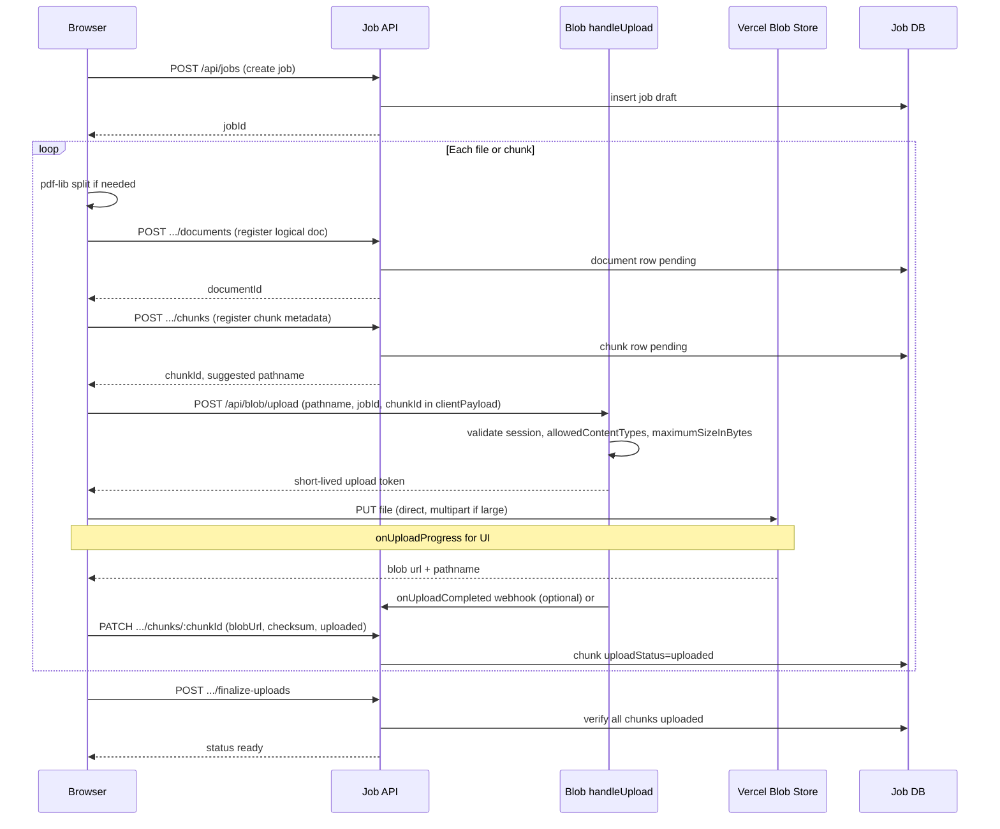
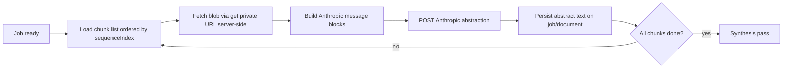

# Phase 2 Design: Durable File & Chunk Storage

**Status:** Design only (no implementation)  
**Depends on:** Phase 1 Job API (job lifecycle, auth, metadata DB)  
**Current baseline:** `public/index.html` keeps files in memory as base64, splits large PDFs in-browser with pdf-lib (`splitPdfIntoEntries`), and posts payloads through `api/analyze.js` under Vercel’s **4.5 MB** request limit.

---

## 1. Phase 1 Job API Assumptions (Dependency Contract)

Phase 2 assumes Phase 1 exposes a **job-centric** API backed by a small relational store (e.g. Neon Postgres). Minimum contract:

| Endpoint | Purpose |
|----------|---------|
| `POST /api/jobs` | Create job → `{ jobId, status: "draft" }` |
| `GET /api/jobs/:jobId` | Job + document/chunk summary, progress |
| `PATCH /api/jobs/:jobId` | Update tract description, labels |
| `POST /api/jobs/:jobId/documents` | Register a logical document (pre-upload) |
| `PATCH /api/jobs/:jobId/documents/:documentId` | Attach metadata after blob upload |
| `POST /api/jobs/:jobId/documents/:documentId/chunks` | Register a processing chunk |
| `PATCH /api/jobs/:jobId/chunks/:chunkId` | Mark chunk `uploaded` / `failed` |
| `POST /api/jobs/:jobId/finalize-uploads` | Validate all chunks uploaded → `status: "ready"` |
| `DELETE /api/jobs/:jobId` | User/admin delete job + schedule blob purge |
| `POST /api/blob/upload` | Vercel Blob `handleUpload` token exchange (auth-gated) |

**Job statuses (Phase 1 + 2):** `draft` → `uploading` → `ready` → (`processing` → `completed` \| `failed`) — Phase 3 owns `processing` onward.

**Auth:** Same gate as today (`APP_PASSWORD` session cookie or bearer token issued after password check). Every job/document/chunk row is scoped to that session (or future user id).

---

## 2. Storage Provider Comparison & Recommendation

| Option | Pros | Cons | Fit for Titlework-analyzer |
|--------|------|------|----------------------------|
| **Vercel Blob** | Native to Vercel deploy; **client direct upload** bypasses 4.5 MB function limit; private access + server `get()`; multipart for large files; simple DX | Vendor lock-in; egress cost for repeated reads; needs `BLOB_READ_WRITE_TOKEN` | **Best primary choice** |
| **S3-compatible** (R2, AWS S3, MinIO) | Portable, enterprise compliance, lifecycle policies, cheaper at scale | Extra integration, presign plumbing, not auto-wired on Vercel Hobby | Good **Phase 2b** via storage interface if customers require it |
| **Database (BYTEA / JSON)** | Transactional with metadata | Poor for 400× multi-MB PDFs; DB size/backup cost; still hits 4.5 MB if proxied through functions | **Reject** for file bytes |
| **Client-only (current)** | Zero infra; strong privacy (never leaves browser) | Tab close = data loss; no server processing; base64 bloat; can’t resume across devices | **Replace** for durability; keep split logic client-side initially |

### Recommendation

**Primary: Vercel Blob (`access: 'private'`)** for all PDF/image/CSV bytes and chunk artifacts.  
**Metadata: Neon Postgres (Phase 1 job DB)** — pointers only (`blobKey`, `blobUrl`, checksum, status).  
**Abstraction text / checkpoints:** remain in DB or blob as small JSON (Phase 3), not mixed with raw scans in Postgres.

**Optional adapter:** `StorageProvider` interface (`put`, `getStream`, `delete`, `createUploadSession`) with `VercelBlobProvider` default and `S3Provider` later — only if multi-cloud is a stated requirement; otherwise defer until requested.

**Do not store full base64 in analyze requests after Phase 3** — workers read from blob and build Anthropic payloads server-side in bounded streams.

---

## 3. Upload Flow Design

### 3.1 Pattern: Direct client upload (recommended)

Large courthouse PDFs must **not** flow through `api/analyze.js`. Use **Vercel Blob client upload** with server-minted tokens (`handleUpload` + `@vercel/blob/client` `upload()`).

**Why not API-proxied upload:** Proxied uploads hit the **4.5 MB** serverless body limit, increase function duration and memory, and duplicate bandwidth. Reserve API routes for **token minting + metadata commits** only (~KB).

### 3.2 Upload sequence diagram



### 3.3 Progress, retry, and concurrency

| Concern | Design |
|---------|--------|
| **Progress** | `@vercel/blob/client` `onUploadProgress`; aggregate per-chunk and per-job in UI |
| **Retry** | Idempotent `chunkId`; re-upload same pathname only if `uploadStatus=failed`; exponential backoff (3–5 attempts); resume multipart parts when SDK supports it |
| **Concurrency** | **4 parallel chunk uploads** (tunable); separate from abstraction concurrency (2) in Phase 3 |
| **Cancel** | `AbortSignal` per upload; mark chunk `cancelled`; don’t finalize job until user confirms |
| **Ordering** | Register metadata **before** upload so tokens bind to `jobId`/`chunkId` |

### 3.4 Size & chunk rules (align with today’s client)

| Rule | Value | Rationale |
|------|-------|-----------|
| Max files per job | **400** | Existing `MAX_FILES` |
| Max single blob upload | **50 MB** default (configurable via env) | Above typical scans; below runaway cost |
| PDF auto-split raw threshold | **1.5 MB** (`PDF_SPLIT_RAW_THRESHOLD`) | Keep current behavior |
| Max chunk raw size (post-split) | **1.5 MB** (`MAX_PDF_CHUNK_RAW_BYTES`) | Matches safe abstraction envelope planning |
| Timeout split chunk raw | **400 KB** (`TIMEOUT_SPLIT_CHUNK_RAW`) | Preserve timeout recovery path |
| Max logical PDF pages per chunk | **Binary search** (existing `splitPdfIntoEntries`) | Proven in repo |
| CSV | Store **UTF-8 blob** + optional `textExtracted` flag; no base64 in API |
| Allowed MIME | `application/pdf`, `image/*`, `text/csv` | Match `accept` on file input |
| Blob pathname | `jobs/{jobId}/chunks/{chunkId}/{sanitizedName}` | Enforce prefix in `onBeforeGenerateToken` |

**Envelope note:** Phase 3 abstraction can read blobs server-side and enforce **~3.5 MB effective payload** per Anthropic call without shipping base64 through the browser.

---

## 4. File / Chunk Metadata Schema

### 4.1 Entity model

```
Job 1──* Document (logical source file)
Document 1──* Chunk (unit sent to abstraction)
```

- **Document:** user-selected file (or synthetic parent for a split PDF).
- **Chunk:** one abstraction input (may be full file or page range).

### 4.2 `documents` table

| Field | Type | Required | Notes |
|-------|------|----------|-------|
| `documentId` | UUID | yes | PK |
| `jobId` | UUID | yes | FK |
| `originalFilename` | string | yes | User-facing name |
| `mediaType` | string | yes | MIME |
| `sizeBytes` | int | yes | Original file size |
| `pageCount` | int | null | PDF only |
| `sourceBlobKey` | string | null | Optional full PDF blob if retained |
| `sourceBlobUrl` | string | null | Private blob URL |
| `uploadStatus` | enum | yes | `pending` \| `uploading` \| `uploaded` \| `failed` \| `skipped` |
| `checksumSha256` | string | null | Original file hash |
| `createdAt` | timestamp | yes | |
| `updatedAt` | timestamp | yes | |

### 4.3 `chunks` table

| Field | Type | Required | Notes |
|-------|------|----------|-------|
| `chunkId` | UUID | yes | PK |
| `jobId` | UUID | yes | FK |
| `documentId` | UUID | yes | FK parent |
| `originalFilename` | string | yes | e.g. `Deed (pp 1-10).pdf` |
| `blobKey` | string | yes | Pathname in blob store |
| `blobUrl` | string | yes | Private URL (not exposed to other jobs) |
| `mediaType` | string | yes | |
| `sizeBytes` | int | yes | Chunk byte size |
| `pageRange` | int[2] | null | `[from, to]` 1-based inclusive |
| `splitFrom` | string | null | Parent filename |
| `checksumSha256` | string | yes | Content-addressed dedup optional |
| `fingerprint` | string | yes | Stable id for resume (port `getFileFingerprint`) |
| `uploadStatus` | enum | yes | `pending` \| `uploading` \| `uploaded` \| `failed` |
| `uploadAttempts` | int | yes | Retry counter |
| `lastError` | string | null | Sanitized message |
| `sequenceIndex` | int | yes | Order within job (0..399) |
| `createdAt` | timestamp | yes | |

### 4.4 JSON API shape (example)

```json
{
  "chunkId": "chk_…",
  "jobId": "job_…",
  "documentId": "doc_…",
  "originalFilename": "Smith Deed (pp 1-8).pdf",
  "blobKey": "jobs/job_…/chunks/chk_…/smith-deed-pp-1-8.pdf",
  "blobUrl": "https://…",
  "mediaType": "application/pdf",
  "sizeBytes": 1240000,
  "pageRange": [1, 8],
  "splitFrom": "Smith Deed.pdf",
  "checksumSha256": "a1b2…",
  "fingerprint": "smith-deed.pdf:…",
  "uploadStatus": "uploaded",
  "createdAt": "2026-05-22T12:00:00Z"
}
```

### 4.5 Indexes

- `(jobId, uploadStatus)` — finalize-uploads validation
- `(jobId, sequenceIndex)` — processing order
- `(documentId)` — cascade delete
- Optional `(checksumSha256, jobId)` — detect duplicate re-uploads within a job

---

## 5. PDF Splitting: Browser vs Server

### Recommendation: Keep splitting in the browser for Phase 2

| Factor | Browser (pdf-lib) | Server-side split |
|--------|-------------------|-------------------|
| **Vercel limits** | Split avoids huge API bodies; only chunk bytes uploaded | Would need blob-in → chunks-out worker; 60s function risk on large PDFs |
| **Privacy** | Full PDF can stay local; only chunks uploaded | Full PDF must be stored server-side first |
| **Retry** | Re-split from `sourceFile` in memory today; with Phase 2, re-split from optional `sourceBlob` or re-select file | Re-split from stored source blob (better cross-session) |
| **Consistency** | Already shipped (`splitPdfIntoEntries`, binary page search) | New dependency (pdf-lib/pdf.js on server), more code |

**Phase 2 behavior**

1. User selects PDF → browser runs existing split logic.
2. Register **document** (optional: upload **source** PDF to private blob if “retain original” enabled — default **off** for privacy).
3. Upload **each chunk** as its own blob + DB row.
4. Store `pageRange`, `splitFrom`, `fingerprint` on chunk rows (same semantics as today).

**Phase 3+ optional:** Server-side split worker triggered when user uploads unsplit large PDF to blob only (single PUT) — useful for cross-device resume without re-uploading from the client. Not required for Phase 2 MVP.

---

## 6. Retention & Deletion

| Policy | Recommendation |
|--------|----------------|
| **Default retention** | **90 days** after `job.completedAt` or last activity (configurable `JOB_RETENTION_DAYS`) |
| **Draft/abandoned uploads** | Purge after **7 days** if never `finalize-uploads` |
| **User delete** | `DELETE /api/jobs/:jobId` → soft-delete job row, enqueue blob deletion for all `blobKey`s |
| **Admin delete** | Same API + admin secret or Vercel dashboard manual purge |
| **Legal/privacy** | Courthouse records are sensitive — document in README/SECURITY: data stored in provider region, not used for model training; customer responsible for county record rules |
| **Title records in DB** | Store **tract description** and **abstracts** separately from blobs; deleting job removes both; do not log filenames or tract text in production logs |
| **Backups** | Rely on blob store lifecycle + DB PITR; no duplicate full-PDF backup unless compliance requires |

**Cascade:** `DELETE job` → delete chunks → delete documents → async `del(blobKey)` (batch with failure retry queue).

---

## 7. Client Changes Needed

| Area | Change |
|------|--------|
| **Job lifecycle** | Create job on “Build Chain of Title”; bind all uploads to `jobId` |
| **File list model** | Replace in-memory `entry.data` base64 with `{ chunkId, blobUrl, uploadStatus }` |
| **Upload pipeline** | After `prepareFileEntries` / split, enqueue chunk uploads via `@vercel/blob/client` |
| **Progress UI** | Per-file and job-level upload % before abstraction progress |
| **Analyze path** | Phase 2: still may call `/api/analyze` with references OR wait for Phase 3; minimum = don’t hold 400 base64 strings in RAM — `freeFileMemory` becomes default after upload |
| **Checkpointing** | Move abstraction checkpoint from `localStorage` to job-scoped server storage (Phase 3); Phase 2 can keep local checkpoint keyed by `jobId` + `fingerprint` |
| **Add More Documents** | New documents attach to existing `jobId` (same job, new `sequenceIndex` range) |
| **Errors** | Distinguish upload failures (retry chunk) vs analysis failures (Phase 3) |

Preserve existing constants (`MAX_FILES`, split thresholds) unless env overrides are added.

---

## 8. API Changes Needed

| Route | New/Modified | Role |
|-------|--------------|------|
| `POST /api/blob/upload` | **New** | `handleUpload`; validate password session; `onBeforeGenerateToken` checks `jobId`, MIME, size; `clientPayload` carries `chunkId` |
| `POST /api/jobs/:jobId/documents` | Phase 1 | Register document |
| `POST /api/jobs/:jobId/documents/:documentId/chunks` | **New** | Pre-create chunk row |
| `PATCH /api/jobs/:jobId/chunks/:chunkId` | **New** | Complete upload metadata |
| `POST /api/jobs/:jobId/finalize-uploads` | **New** | Gate Phase 3 |
| `GET /api/jobs/:jobId/chunks` | **New** | List chunks for resume UI |
| `DELETE /api/jobs/:jobId` | Phase 1 | Trigger blob purge worker |
| `api/analyze.js` | **Unchanged in Phase 2** | Phase 3 switches to blob-backed inputs |

**Env vars:** `BLOB_READ_WRITE_TOKEN`, `JOB_RETENTION_DAYS`, `BLOB_MAX_UPLOAD_BYTES`, existing `APP_PASSWORD`.

---

## 9. Security & Privacy Considerations

| Topic | Control |
|-------|---------|
| **Access** | All blobs **`private`**; browser never gets long-lived read token; only upload token |
| **Authorization** | Token endpoint verifies session owns `jobId` in `clientPayload` |
| **Path traversal** | Server generates pathname; reject client-supplied `../` |
| **Enumeration** | UUIDs for job/document/chunk; rate-limit job creation |
| **Data residency** | Document in operator docs; Vercel Blob region follows project |
| **Logging** | Log `jobId`, `chunkId`, bytes, status — not tract description or filenames in prod |
| **CSP** | Allow connect to blob storage host for direct upload |
| **Deletion** | Right to delete = job DELETE; blobs removed asynchronously with audit log count only |
| **Encryption** | At-rest encryption by provider; TLS in transit |
| **APP_PASSWORD** | Still app-level gate; not a substitute for per-user ACL — note for future auth |

---

## 10. How Phase 3 Consumes Stored Files

Phase 3 **processing worker** assumes `job.status === "ready"`:



| Step | Behavior |
|------|----------|
| **Input** | `GET /api/jobs/:jobId/chunks?uploadStatus=uploaded` |
| **Read** | `get(blobUrl)` stream → base64 or document block only inside worker memory |
| **Batching** | Reuse `buildAdaptiveBatches` logic server-side using `sizeBytes` from DB (no client base64 estimate) |
| **Timeout split** | If chunk still times out, worker may fetch parent PDF blob (if stored) and sub-split, or mark `needs_resplit` for client |
| **Output** | Store abstracts in DB; optional small JSON checkpoint blob |
| **analyze.js** | Becomes thin orchestrator or deprecated in favor of `api/jobs/:id/process` |

**Key win:** Browser tab can close after upload; processing resumes from blob + DB state.

---

## 11. Migration Path from Current App

| Phase | User-visible behavior |
|-------|----------------------|
| **2a** | Upload to blob + metadata; still analyze via legacy in-memory path for parity |
| **2b** | Analyze reads blob URLs server-side only |
| **3** | Full job processing pipeline + server synthesis |

Feature flag: `USE_DURABLE_STORAGE=true` toggles new upload path without breaking Hobby deployments missing Blob store.

---

## 12. Summary Decisions

| Decision | Choice |
|----------|--------|
| **Storage provider** | **Vercel Blob (private)** + Postgres metadata |
| **Upload path** | **Direct browser → Blob** with `handleUpload` token exchange |
| **PDF splitting** | **Stay in browser** (existing pdf-lib); upload chunks only |
| **Retention** | **90 days** completed, **7 days** abandoned drafts |
| **Phase 3 input** | Server streams private blobs into Anthropic; job/chunk tables drive batching |

This design removes the **400-file in-memory base64** constraint, satisfies Phase 1 job ownership, and sets up Phase 3 server-side processing without passing multi-megabyte bodies through `api/analyze.js`.
