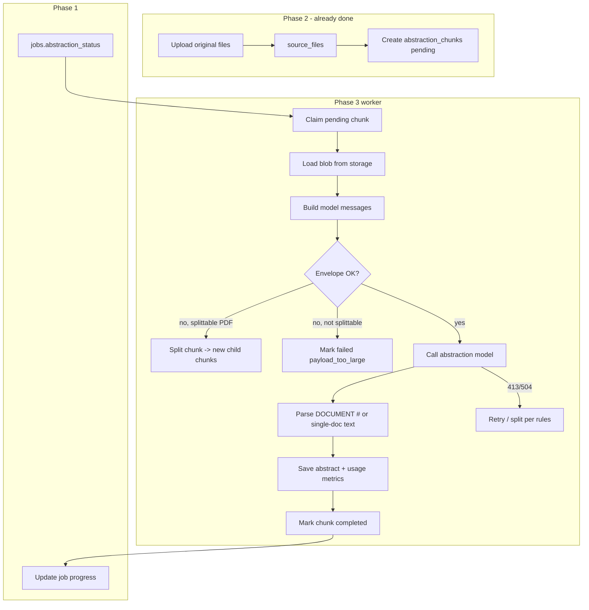

# Phase 3 Design: Server-Side Document Abstraction

**Status:** Design only (no implementation)  
**Prerequisites:** Phase 1 job records, Phase 2 file/chunk blob storage  
**Current baseline:** Browser orchestrates abstraction via `runDocumentAbstraction` → `abstractBatch` → `/api/analyze` proxy; PDF splitting, batching, retries, and checkpoints live in `public/index.html`.

---

## 1. Abstraction unit (decision)

### Recommendation: one persisted `abstraction_chunk` per model invocation target

The durable unit of work is **not** the user’s original upload and **not** an adaptive client batch. It is a single **abstraction chunk** — the smallest piece that can be loaded from storage, converted to one model input block, and abstracted independently with its own status, retries, and stored abstract.

| Source type | Chunk granularity | Notes |
|-------------|-------------------|-------|
| PDF (small) | Whole file | One chunk if ingest envelope check passes |
| PDF (large) | **Page range** | Pre-split at ingest (mirror `splitPdfIntoEntries`: binary search on page count, ~1.5 MB raw / envelope-safe encoded) |
| Image | Whole file | One chunk per image |
| CSV | Whole file | Text inlined in prompt (no vision block) |
| Original document | Parent only | `source_file` record; **never** the worker claim target |

**Why not batch as the unit?** Today up to two documents share one API call (`MAX_DOCS_PER_BATCH = 2`). That is an optimization. Persisting at batch level complicates partial failure, 413/504 split, and “preserve successful abstracts.” Phase 3 should **claim and complete one chunk at a time**; optional **ephemeral micro-batching** (≤2 chunks, same envelope) may remain as a worker implementation detail without changing the schema.

**Document numbering for synthesis:** Each chunk gets a stable `sequence_index` (0-based, unique per job) assigned at ingest. Synthesis (still client or later server phase) uses `sequence_index` + `display_name` — same role as today’s `DOCUMENT #N` labels.

**Multi-part PDF merge:** When a source PDF splits into multiple chunks, store `parent_source_file_id` and `page_range_start` / `page_range_end`. Synthesis prompt hints (already in client) carry over: parts share a source filename pattern.

---

## 2. Server-side abstraction flow



### Per-chunk state machine

```
pending → processing → completed
                    ↘ failed (terminal)
                    ↘ split_superseded (parent chunk replaced by children)
```

- **`split_superseded`:** Parent chunk failed 413/504 and was subdivided; children are new `pending` rows. Parent keeps no abstract (or optional merge stub — not required for v1).

### Step-by-step (worker)

1. **Claim** — Atomic update: `pending` → `processing`, set `claimed_at`, `worker_id`, increment `attempt_count` (or separate `claim_generation`).
2. **Load** — Fetch bytes via Phase 2 `storage_key` / signed URL; CSV loads as UTF-8 text.
3. **Convert** — Build Anthropic-compatible blocks (same rules as `buildAbstractMessages`: PDF `document`, image `image`, CSV in text).
4. **Envelope** — Serialize full request (model, `max_tokens`, system prompt, messages). Reject/split if `> REQUEST_ENVELOPE_SAFE_BYTES` (3.9 MB, aligned with client).
5. **Call model** — Internal provider client (not browser); timeout ≤ 52s upstream (match `api/analyze.js` `UPSTREAM_TIMEOUT_MS`).
6. **Parse** — For single-chunk calls, entire response is abstract text. If ephemeral batching used, regex-split on `DOCUMENT #N` (same as `parseBatchResult`).
7. **Save** — `abstract_text`, token usage, latency, `model_id`, `request_payload_bytes`.
8. **Complete** — `status = completed`, `completed_at`.
9. **Job rollup** — Phase 1: when all chunks terminal (`completed` or `failed`), set `job.abstraction_status` to `completed` / `completed_with_errors` / `failed`.

### Concurrency

| Knob | Suggested default | Rationale |
|------|-------------------|-----------|
| Chunks in parallel per job | 2–4 | Matches current `ABSTRACT_CONCURRENCY = 2`; scale with Fluid Compute |
| Global worker concurrency | Env-configured | Respect Anthropic rate limits |
| Stale claim recovery | 90s heartbeat | Requeue `processing` if `claimed_at` stale |

---

## 3. Required API and worker functions

### HTTP APIs (Vercel)

| Endpoint | Method | Purpose |
|----------|--------|---------|
| `/api/jobs/:jobId/abstraction/start` | POST | Idempotent enqueue: set chunks `pending`, job `abstraction_status = running` |
| `/api/jobs/:jobId/abstraction/status` | GET | Progress: counts by status, failed chunk list, ETA fields |
| `/api/jobs/:jobId/abstracts` | GET | Ordered `{ sequence_index, display_name, abstract_text, status }` for synthesis |
| `/api/jobs/:jobId/chunks/:chunkId/retry` | POST | Reset single `failed` chunk → `pending` (admin/resume) |
| `/api/internal/worker/abstract-next` | POST | Claim + process one chunk (cron or queue consumer) |

**Auth:** Same as today (`APP_PASSWORD` / session); worker endpoint uses `WORKER_SECRET` or Vercel cron OIDC.

### Worker modules (library, not necessarily separate deploy)

| Function | Responsibility |
|----------|----------------|
| `claimNextChunk(jobId?)` | DB lock, return chunk + storage ref |
| `loadChunkPayload(chunk)` | Bytes/text from Phase 2 |
| `buildAbstractMessages(chunk, sequenceIndex)` | Port from client |
| `estimateRequestBytes(messages, model, system, maxTokens)` | Port from client |
| `invokeAbstractModel(payload)` | Direct Anthropic call + structured errors |
| `parseAbstractResponse(text, chunk)` | Single-doc or numbered sections |
| `persistAbstractResult(chunkId, result)` | Transactional write |
| `handleChunkFailure(chunk, error)` | Retry vs split vs terminal fail |
| `splitPdfChunk(chunk, reason)` | Create child chunks, supersede parent |
| `rollupJobAbstractionStatus(jobId)` | Aggregate counts |

### Triggers

- **On upload complete (Phase 2):** Create chunks + `pending`.
- **On job start:** Cron / Vercel Workflow / `waitUntil` loop until job abstraction done.
- **On 413/504:** Inline split + re-enqueue children (no user re-upload).

### Synthesis boundary (out of scope for Phase 3 implementation, in scope for interface)

Phase 3 delivers **`GET /api/jobs/:jobId/abstracts`**. Browser (or Phase 4 server synthesis) continues to call Sonnet with abstract text only — **no file bytes** in synthesis requests.

---

## 4. Data schema

### `abstraction_chunks` (primary)

| Field | Type | Description |
|-------|------|-------------|
| `id` | uuid | PK |
| `job_id` | uuid | FK → jobs |
| `source_file_id` | uuid | FK → source_files (original upload) |
| `parent_chunk_id` | uuid? | Set when created by PDF split |
| `chunk_kind` | enum | `pdf_page_range`, `pdf_whole`, `image`, `csv` |
| `display_name` | string | e.g. `deed.pdf` or `deed (pp 1-12).pdf` |
| `sequence_index` | int | Stable order within job |
| `page_range_start` | int? | 1-based inclusive |
| `page_range_end` | int? | 1-based inclusive |
| `storage_key` | string | Phase 2 blob reference |
| `raw_bytes` | int | Stored object size |
| `media_type` | string | `application/pdf`, `image/jpeg`, etc. |
| **status** | enum | `pending`, `processing`, `completed`, `failed`, `split_superseded` |
| **abstract_text** | text? | Model output (null until completed) |
| **model_id** | string? | e.g. `claude-haiku-4-5` |
| **request_payload_bytes** | int? | Serialized JSON size sent upstream |
| **latency_ms** | int? | End-to-end chunk processing |
| **input_tokens** | int? | From provider usage |
| **output_tokens** | int? | From provider usage |
| **error_type** | enum? | `payload_too_large`, `upstream_timeout`, `rate_limit`, `provider_error`, `parse_error`, `storage_error`, `unsplittable` |
| **error_message** | string? | Sanitized, user-safe subset |
| **retry_count** | int | Failed attempts before success or terminal fail (default 0) |
| `max_attempts` | int | Default **5** |
| `last_attempt_at` | timestamptz? | |
| `claimed_at` | timestamptz? | |
| `worker_id` | string? | |
| `completed_at` | timestamptz? | |
| `created_at` | timestamptz | |
| `updated_at` | timestamptz | |

### Job-level fields (Phase 1 extension)

| Field | Type | Description |
|-------|------|-------------|
| `abstraction_status` | enum | `not_started`, `running`, `completed`, `completed_with_errors`, `failed` |
| `abstraction_started_at` | timestamptz? | |
| `abstraction_completed_at` | timestamptz? | |
| `abstract_chunk_total` | int | Denormalized count |
| `abstract_chunk_completed` | int | |
| `abstract_chunk_failed` | int | |

### Indexes

- `(job_id, status)` where `status = pending` for claim queue
- `(job_id, sequence_index)` unique
- `(source_file_id)` for debugging splits

---

## 5. Retry and splitting rules

Port behavior from `abstractBatch`, `abstractSinglePdfOnTimeout`, and `api/analyze.js`, but **at chunk granularity**.

### Constants (align with client)

| Constant | Value | Use |
|----------|-------|-----|
| `REQUEST_ENVELOPE_SAFE_BYTES` | 3_900_000 | Pre-flight + server 413 mirror |
| `MAX_PAYLOAD_BYTES` | ~3_550_000 | File payload budget (optional batching) |
| `MAX_PDF_CHUNK_RAW_BYTES` | 1_500_000 | Ingest split target |
| `TIMEOUT_SPLIT_CHUNK_RAW` | 400_000 | Finer split on 504 |
| `TIMEOUT_SAFE_FILE_BYTES` | 350_000 | Force single-chunk / no batch |
| `MAX_ATTEMPTS` | 5 | Terminal fail |
| `RETRY_BACKOFF_MS` | 2s × 2^attempt, cap 60s | Rate limits / transient 5xx |

### 413 / envelope too large

1. If **one PDF chunk** and `page_range` spans >1 page → **split_superseded**, create children with halved page range (binary search on pages, same as client).
2. If **single page** still exceeds envelope → `failed`, `error_type = payload_too_large`, `unsplittable`.
3. **Do not** delete sibling `completed` chunks on same job.

### 504 / timeout

1. If `retry_count < max_attempts` and chunk is **not PDF** → retry with backoff (same bytes).
2. If **PDF** and `raw_bytes > TIMEOUT_SPLIT_CHUNK_RAW` → split with `maxChunkRaw = 400_000`, supersede parent, enqueue children; **split does not increment `retry_count`**; only provider call failures do.
3. If PDF cannot split further (1 page, still timeout) → `failed`, `upstream_timeout`.
4. Transient 429/529 → backoff retry.

### Rate limit (429)

- Exponential backoff; respect `Retry-After` if present.
- Job stays `running`; UI shows throttle message (replace client `CLIENT_MAX_REQUESTS_PER_MIN` with server-side token bucket).

### Terminal failure

- `status = failed` when `retry_count >= max_attempts` and error not splittable.
- Job → `completed_with_errors` if any failed and any completed; `failed` only if **zero** completed and all terminal.

### Preserve successful abstracts

- Never overwrite `completed` rows on job retry.
- `POST .../retry` only resets explicit `failed` chunks to `pending`.
- Re-running job abstraction start is idempotent: only `pending`/`failed` (optional flag) are enqueued.

---

## 6. Model strategy

### Primary recommendation: keep Claude Haiku 4.5 (`claude-haiku-4-5`)

| Criterion | Haiku 4.5 | Gemini 2.0 Flash | GPT-4.1 mini |
|-----------|-----------|------------------|--------------|
| Title field extraction | Strong; current prompt tuned | Good; different API shape | Good |
| PDF + image native input | Anthropic `document` / `image` blocks (already implemented) | Google multimodal | OpenAI file/vision paths |
| Cost (bulk 200 docs) | ~$2–6/run per README | Often lower $/token; egress + integration cost | Mid-tier |
| Latency | Fast | Very fast | Fast |
| Risk | Lowest migration | New provider, schema, QA | New provider, PDF handling |

**Rationale:** The product already whitelists Haiku in `api/analyze.js`, uses Haiku-specific content blocks, and documents pricing around Haiku + Sonnet. Phase 3 should **not** switch default models; add `ABSTRACT_MODEL` env override for experiments.

**Optional later:** Provider interface with fallback order `haiku → flash` on 529/overload only — not Phase 3 MVP.

**Synthesis unchanged:** Sonnet 4.6 stays client-side (or Phase 4); Phase 3 only moves **abstraction**.

---

## 7. Test plan

### Unit tests

- `buildAbstractMessages` parity: golden fixtures per `chunk_kind` (PDF, image, CSV).
- `estimateRequestBytes` vs known client cases from `test/reliability.test.js`.
- `parseAbstractResponse` for `DOCUMENT #1` / `#2` boundaries.
- Split logic: page-range bisection produces envelope-safe children (mock storage).

### Integration tests

- Claim idempotency: two workers, one chunk claimed.
- 413 path: oversized PDF chunk → children `pending`, parent `split_superseded`.
- 504 path: mock slow provider → finer PDF split.
- Partial job: 3/5 chunks complete, 2 fail → `completed_with_errors`, abstracts API returns 3.
- Retry endpoint: failed chunk reset → completes on second run.
- **No regression:** `GET abstracts` order matches `sequence_index`.

### Load / reliability

- 50-chunk job, concurrency 2: no duplicate claims.
- Stale `processing` reclaimed after TTL.
- Payload logging: `request_payload_bytes` never logged with base64 body (metadata only).

### Migration verification

- Shadow mode: same files, compare browser vs server abstracts (normalized diff threshold).

---

## 8. Migration path from browser abstraction

### Phase 3a — Shadow (optional but recommended)

1. Phase 2 ingest creates chunks server-side (same rules as client `prepareFileEntries`).
2. Browser still runs `runDocumentAbstraction` as today.
3. Server worker runs in parallel, writes to DB; compare hashes, log mismatches.

### Phase 3b — Server primary, browser fallback

1. On **Build Chain of Title**, client uploads → receives `jobId` → `POST .../abstraction/start`.
2. Client polls `GET .../abstraction/status` (replaces local checkpoint for abstraction only).
3. On completion, `GET .../abstracts` → populate `documentAbstracts` → existing `hierarchicalSynthesis` unchanged.
4. Feature flag `USE_SERVER_ABSTRACTION=true`; if worker stalled, fall back to in-browser path (temporary).

### Phase 3c — Remove browser abstraction

- Delete or gate: `runDocumentAbstraction`, `abstractBatch`, `abstractSinglePdfOnTimeout`, `buildAdaptiveBatches`, localStorage abstraction checkpoints.
- Keep: PDF split at upload **or** move split entirely server-side at ingest (preferred — single source of truth).
- Client throttling (`requestSlotQueue`, 120 req/min) shrinks to synthesis + follow-up only.

### Data migration

- No backfill required for historical runs (ephemeral). New jobs only use chunks table.

### User-visible changes

| Today | After migration |
|-------|-----------------|
| Tab must stay open for abstraction | Can close tab; job continues server-side |
| localStorage checkpoint | Server progress + optional resume |
| 400 files in browser memory | Files in blob storage; browser holds metadata only |
| Re-upload on failure | Retry failed chunks only |

---

## 9. Open decisions (for Phase 1/2 owners)

1. **Queue technology:** Vercel Cron polling vs Workflow DevKit vs external queue (Upstash) for >400-chunk jobs.
2. **Ingest split location:** Client `pdf-lib` vs server split at upload (recommended: **server at ingest** so chunk list is canonical before any worker runs).
3. **Ephemeral 2-doc batching in worker:** Default **off** in v1 for simpler ops; enable if cost measurement warrants.
4. **PII retention:** TTL on blob storage vs job lifetime (align with SECURITY.md).

---

## 10. Summary

| Topic | Decision |
|-------|----------|
| Unit of work | **`abstraction_chunk`** (PDF page range, whole image/CSV/small PDF) |
| Flow | Claim → load → envelope → model → parse → persist → rollup job |
| Retries | 413/504 → PDF split; else backoff; max 5; preserve `completed` |
| Model | **Haiku 4.5** default; Sonnet unchanged for synthesis |
| APIs | start/status/abstracts/retry + internal worker claim |
| Migration | Shadow → flag server primary → remove client abstraction |
