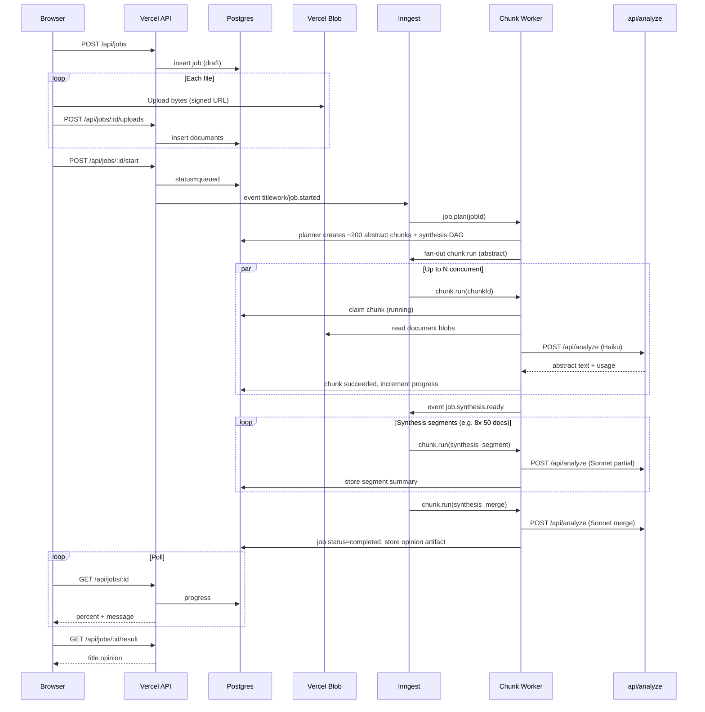

# Phase 4: Background Workflow / Queue Processing — Design Spec

**Project:** Mineral Ownership Builder (Titlework-analyzer)  
**Goal:** Process **200–400 document jobs** without relying on one browser tab or one long synchronous Vercel function.  
**Status:** Implemented (in-process driver). Inngest adapter deferred — see [Implementation notes](#implementation-notes) below.

---

## Implementation notes

The shipped Phase 4 follows this design with one deliberate substitution: the workflow driver defaults to an **in-process Postgres-backed queue** instead of Inngest. The master plan permits this fallback when Inngest is not already configured, and avoids silently adding a new paid dependency. The seams listed in §1 (workflow adapter, fan-out, concurrency limits) are preserved so an Inngest adapter can be plugged in later by setting `WORKFLOW_DRIVER=inngest` and providing the keys.

What ships in this phase:

- `POST /api/jobs/:id/abstraction/start` returns `202 Accepted` and schedules background work via Node's task queue / Vercel `waitUntil` (when available). Each invocation drains pending chunks for up to ~45s under bounded concurrency, then exits cleanly.
- `POST /api/jobs/:id/abstraction/process` drains a batch synchronously (useful for cron, scripts, or manual recovery).
- `POST /api/jobs/:id/cancel` marks the job canceled; the worker checks job status before each chunk and exits cleanly.
- `POST /api/jobs/:id/retry-failed` resets every `failed`/`retry_wait` chunk back to `pending` and kicks the worker; completed abstracts are preserved.
- `POST /api/jobs/:id/chunks/:chunkId/retry` (Phase 3) still retries a single chunk.
- Chunk-level lease tracking: `abstraction_claimed_at`, `abstraction_lease_expires_at`, `abstraction_worker_id`, `abstraction_retry_at`. Default lease 90s; stale leases reset to `pending` on the next status poll, start, or process call.
- New chunk status `retry_wait` for transient errors with attempts remaining; chunks transition `pending → processing → completed`, with `retry_wait` and `split_superseded` paths preserved.
- Retry/backoff: rate-limit (`Retry-After` respected), upstream timeout, provider, and storage errors get exponential backoff up to `ABSTRACTION_MAX_ATTEMPTS`; 413/504 PDF splits still create child chunks and supersede the parent.
- Job status rolls up: `abstracting` while work remains, `synthesizing` (ready-for-synthesis) when every chunk completes, `partial_failed` when some chunks fail terminally, `failed` when all chunks fail, `canceled` on cancel.
- Frontend polls `/abstraction/status` and re-kicks `/abstraction/start` automatically when progress stalls (worker died, lease expired, etc.). Existing browser-driven fallback is preserved when storage or workflow setup is unavailable.

Tuning knobs (env vars): `WORKFLOW_DRIVER`, `WORKFLOW_BATCH_LIMIT`, `WORKFLOW_CONCURRENCY`, `WORKFLOW_BUDGET_MS`, `WORKFLOW_LEASE_MS`, `WORKFLOW_STALE_LEASE_MS`, `ABSTRACTION_MAX_ATTEMPTS`. Defaults are tuned for Vercel's 60s function ceiling and 300 req/min Anthropic rate envelope.

Out of scope (intentionally deferred):

- Durable server-side synthesis (Phase 5).
- Inngest-backed adapter (event functions, fan-out via `step.sendEvent`, per-job concurrency keys). The DB-backed queue covers everything Phase 4 requires; the Inngest adapter is a future optimization once event-level cancellation or external observability is needed.

---

## Executive summary

Move the existing two-stage pipeline (Haiku abstraction → Sonnet synthesis) from **browser-orchestrated, in-memory execution** to **server-owned jobs** with durable state, blob storage for inputs/outputs, and an orchestrator that fans out work in bounded parallelism.

**Recommended stack:**

| Layer | Choice | Role |
|-------|--------|------|
| Orchestration | **Inngest** | Durable workflows, fan-out/fan-in, retries, cancellation, global concurrency |
| Source of truth | **Neon Postgres** | Jobs, documents, chunks, leases, progress, cost rows |
| File storage | **Vercel Blob** | Original uploads + optional chunk PDFs |
| Compute | **Vercel Functions** (`api/analyze.js` extended or sibling routes) | Anthropic proxy (60s, 4.5 MB limits unchanged) |
| UI | **Polling/SSE** on job APIs | User can close the tab; job continues |

**Why not browser + single function:** Today `public/index.html` holds files in memory, runs ~120 req/min client throttle, `ABSTRACT_CONCURRENCY = 2`, and blocks for 30–60+ minutes. Any tab close, refresh, or OOM loses orchestration. Vercel `maxDuration: 60` and `UPSTREAM_TIMEOUT_MS: 52_000` in `api/analyze.js` forbid one function running a full job.

---

## 1. Workflow technology comparison

### 1.1 Options

| Criterion | Vercel Workflow (WDK) | Inngest | Trigger.dev | QStash | DB-backed queue only |
|-----------|----------------------|---------|-------------|--------|----------------------|
| **Fit for 200–400 parallel LLM steps** | Many `"use step"` invocations; step history grows with job size | Native fan-out (`step.sendEvent`), `concurrency` limits | Similar; strong DX for long tasks | Push HTTP per message; orchestration is DIY | Full DIY |
| **Fan-out / fan-in (abstraction batches → synthesis tree)** | Possible via child workflows / loops | First-class | First-class | Manual DAG in app code | Manual DAG |
| **Global Anthropic rate limit** | Custom throttle in steps | `rateLimit` + `concurrency` keys | Built-in limits | Retry/delay headers only | Custom in worker |
| **Cancellation** | `npx workflow cancel` | `cancelOn` / cancel API | Cancel run | Unschedule / DLQ | Update `jobs.status = cancelled` + stop lease |
| **Vercel coupling** | Native | Official integration | Hosted workers (can target Vercel) | Upstash + Vercel | None beyond DB/cron |
| **Operational maturity for this repo** | Newer; sandbox rules for workflow vs step | Mature for queue-like workloads | Mature | Thin queue layer | Highest build cost |
| **Cost / complexity** | Step count × invocations | Event + function invocations | Similar | Low $ + more code | Lowest vendor $, highest engineering |

### 1.2 Recommendation: **Inngest + Postgres + Blob**

1. **Workload shape:** A 400-document job is ~150–250 abstraction **chunks** (adaptive batches of ≤2 docs, ~3.9 MB envelope) plus **8–12 synthesis steps** (50-doc segments + merge). That is a **DAG with hundreds of leaves**, not one workflow run — Inngest’s event model matches this without inventing a lease/visibility system.
2. **Concurrency:** Need **global** caps (Anthropic TPM/RPM, Vercel `ANALYZE_RATE_LIMIT_MAX` per deployment) and **per-job** caps (fairness). Inngest `concurrency: { limit: N, key: "anthropic" }` and `key: "job:{jobId}"` are explicit.
3. **Retries:** LLM calls are idempotent at the chunk level (re-run produces new text; store by `chunk_id`). Inngest step retries + app-level split-on-timeout mirror current `abstractBatch` / `abstractSinglePdfOnTimeout` behavior.
4. **Tab independence:** Job state in Postgres; UI only subscribes to status.
5. **Vercel Workflow** is a strong **second choice** if the team mandates a single Vercel vendor: use WDK for orchestration only, keep Postgres as authoritative state, and accept higher step-count operational overhead.

**Not recommended as primary orchestrator:**

- **QStash alone** — good transport, but synthesis DAG, cancellation, and progress aggregation still require substantial custom code (effectively a half-built Inngest).
- **DB queue alone** — viable for a minimal MVP, but for 200–400 doc jobs you will recreate Inngest features (leasing, backoff, cron recovery, fan-in barriers) within weeks.

---

## 2. Worker architecture

### 2.1 High-level components

```text
┌─────────────┐     upload      ┌──────────────┐     create job     ┌─────────────┐
│   Browser   │ ──────────────► │  API Routes  │ ─────────────────► │   Postgres  │
│  (thin UI)  │                 │ jobs/upload  │                    │ jobs/chunks │
└──────┬──────┘                 └──────┬───────┘                    └──────▲──────┘
       │ poll/SSE                      │ start                           │
       │                               ▼                                 │ read/write
       │                        ┌──────────────┐                         │
       └──────────────────────► │   Inngest    │ ── step functions ──────┤
                                │  functions   │     (Vercel routes)      │
                                └──────┬───────┘                         │
                                       │ call                            │
                                       ▼                                 │
                                ┌──────────────┐     blobs               │
                                │ api/analyze  │ ◄── Vercel Blob ────────┘
                                │  (Anthropic) │
                                └──────────────┘
```

### 2.2 Job types and chunk model

Preserve existing client semantics; encode them as rows:

| Chunk `kind` | Maps to today | Input | Output stored |
|--------------|---------------|-------|----------------|
| `abstract_batch` | `buildAdaptiveBatches` + `abstractBatch` | 1–2 docs (blob refs), doc indices | Per-doc abstract text |
| `abstract_pdf_split` | `abstractSinglePdfOnTimeout` | 1 PDF page-range blob | Partial abstract(s) |
| `synthesis_segment` | `hierarchicalSynthesis` segment loop | Abstract texts for doc range | Segment summary |
| `synthesis_merge` | Final merge step | Segment summaries | Title opinion markdown |
| `followup` | `askFollowup` | Question + opinion ref | Reply text (optional async later) |

**Documents** table: one row per uploaded file (after server-side PDF split normalization). **Chunks** are the unit of queueing; batches reference `document_ids[]`.

Chunk planning runs once in **`job/plan`** (Inngest function): reads document metadata (size, type), runs the same batching logic as `buildAdaptiveBatches` / `finalizeBatchesForTimeout` (port from `public/index.html`), inserts chunk rows, emits `chunk/ready` events.

### 2.3 Job execution model

#### How a job starts

1. `POST /api/jobs` — metadata: `tract_description`, `context_notes`, optional `parent_job_id` (add-more-docs).
2. `POST /api/jobs/:id/uploads` — multipart or signed Blob upload per file; server records `documents` + blob URLs.
3. `POST /api/jobs/:id/start` — validates all uploads complete, sets `status = queued`, sends Inngest event `titlework/job.started`.
4. Planner step creates chunks → fan-out `titlework/chunk.run` with chunk IDs.

Alternative: combine (2) and (3) when last file upload finishes (auto-start).

#### How pending chunks are claimed

**Authoritative pattern:** Postgres row lifecycle, not in-memory queues.

```sql
-- Claim (worker step)
UPDATE job_chunks
SET status = 'running',
    lease_owner = $worker_id,
    lease_expires_at = now() + interval '90 seconds',
    started_at = coalesce(started_at, now()),
    attempt_count = attempt_count + 1
WHERE id = $chunk_id
  AND status IN ('pending', 'retry_wait')
  AND (lease_expires_at IS NULL OR lease_expires_at < now())
RETURNING *;
```

Inngest invokes one function per chunk (or per batch of chunk IDs with internal loop). The DB claim prevents double execution if Inngest redelivers.

**Stale lease recovery:** Cron/`inngest/cron.recover-stale-leases` every 2–5 min resets `running` → `retry_wait` when `lease_expires_at < now()` and `attempt_count < max_attempts`.

#### Concurrency limits

| Scope | Suggested default | Rationale |
|-------|-------------------|-----------|
| Global abstraction | **6–10** concurrent chunks | ~3× current client `ABSTRACT_CONCURRENCY=2` without blowing Anthropic RPM |
| Global synthesis | **2** concurrent | Sonnet is slower, larger payloads |
| Per `job_id` abstraction | **4** | Fairness when multiple users |
| Per `job_id` synthesis | **1** | Merge depends on ordered segments |
| Anthropic API (Inngest `rateLimit`) | **80–100 requests / minute** | Below server `ANALYZE_RATE_LIMIT_MAX` (300–600) but above single client 120/min |

Tune via env: `GLOBAL_ABSTRACT_CONCURRENCY`, `GLOBAL_SYNTHESIS_CONCURRENCY`, `ANTHROPIC_RATE_LIMIT_PER_MIN`.

#### Retry / backoff policy

| Error class | Chunk behavior | Max attempts |
|-------------|----------------|--------------|
| 429 / overloaded | `retry_wait`, exponential backoff 30s → 60s → 120s (cap 10 min) | 8 |
| 504 / timeout | Split chunk (halve batch or PDF page split) **then** retry children | Split depth ≤ 4 |
| 413 / payload too large | Planner split or `abstract_pdf_split` chunk | 3 |
| 401 / 403 / invalid key | **Fatal** job `failed` | 1 |
| 400 validation | **Fatal** chunk `failed_permanent` | 1 |
| Unknown 5xx | `retry_wait`, backoff 15s × 2^n | 5 |

Inngest step `retries: 3` for infrastructure failures only; **business retries** update Postgres and re-emit `chunk.run` so split state is persisted.

#### Timeout handling

| Layer | Limit | Action |
|-------|-------|--------|
| Vercel function | 60s (`vercel.json`) | Keep; chunk work must finish one Anthropic call per invocation |
| Upstream Anthropic | 52s (`UPSTREAM_TIMEOUT_MS`) | Unchanged in `api/analyze.js` |
| Chunk lease | 90s | Reclaim if worker dies mid-flight |
| Whole job | 6h soft / 12h hard | `jobs.deadline_at`; mark `failed` with `timeout` |

#### Cancellation

- `POST /api/jobs/:id/cancel` → `jobs.status = cancelling`, `cancelled_at = now()`.
- Inngest `cancelOn` keyed by `jobId` on all functions for that job.
- Workers check `jobs.status` before Anthropic call; if cancelled, set chunk `cancelled` and exit.
- Partial abstracts remain queryable; synthesis chunks not started are `cancelled`.

#### Partial failure behavior

| Scenario | Job status | User-visible outcome |
|----------|------------|----------------------|
| Some abstraction chunks fail permanently | `completed_with_errors` | Show opinion only if synthesis still runnable with subset; else block synthesis |
| &lt;100% abstracts, user opts in | `completed_with_errors` | Synthesis prompt lists missing doc numbers |
| Synthesis segment fails | `failed` at synthesis phase | Abstracts downloadable; retry synthesis only (`POST /api/jobs/:id/retry-synthesis`) |
| All abstraction OK, merge fails | `failed` | `retry-synthesis` reuses stored abstracts |

**Barrier:** Synthesis starts when `completed_abstract_chunks = total_abstract_chunks` OR `jobs.allow_partial_synthesis = true` and `completed ≥ floor(0.95 * total)`.

---

## 3. State transitions

### 3.1 Job status (`jobs.status`)

```text
draft → uploading → queued → planning → abstracting → synthesizing → completed
                              ↘ cancelling → cancelled
                              ↘ failed
                              ↘ completed_with_errors
```

| Status | Meaning |
|--------|---------|
| `draft` | Job created, no uploads |
| `uploading` | Accepting files |
| `queued` | Start requested, waiting for planner |
| `planning` | Building chunk graph |
| `abstracting` | Any abstract chunk not terminal |
| `synthesizing` | All required abstracts done; synthesis chunks running |
| `completed` | Title opinion stored |
| `completed_with_errors` | Opinion or partial artifacts with failed chunks |
| `cancelling` / `cancelled` | User or admin stop |
| `failed` | Unrecoverable |

### 3.2 Chunk status (`job_chunks.status`)

```text
pending → running → succeeded
         ↘ retry_wait → running
         ↘ failed_retryable → retry_wait (if attempts left)
         ↘ failed_permanent
         ↘ cancelled
         ↘ split_superseded (parent replaced by child chunks)
```

### 3.3 Worker update rules (single transaction per chunk completion)

After Anthropic success:

1. Write `chunk.output_artifact_id` or `output_text`.
2. Set `status = succeeded`, `finished_at = now()`, clear lease.
3. Increment `jobs.completed_*_count` via trigger or `UPDATE ... RETURNING`.
4. If abstraction barrier met, emit `titlework/job.synthesis.ready`.

On failure:

1. Set `last_error_code`, `last_error_message` (truncated 2 KB).
2. Increment `attempt_count`.
3. Either schedule `retry_wait` with `next_attempt_at`, split into new chunks, or `failed_permanent`.

### 3.4 Progress counts (denormalized on `jobs`)

| Field | Updated when |
|-------|----------------|
| `total_documents` | Upload complete |
| `total_abstract_chunks` | Planning done |
| `completed_abstract_chunks` | Abstract chunk succeeds |
| `failed_abstract_chunks` | Permanent abstract failure |
| `total_synthesis_chunks` | Planner creates synthesis DAG |
| `completed_synthesis_chunks` | Synthesis step succeeds |
| `progress_percent` | Weighted: abstracting 0–85%, synthesizing 85–100% |
| `progress_message` | Human string for UI |

### 3.5 Cost tracking hooks (per chunk attempt)

Insert into `api_usage_events`:

- `job_id`, `chunk_id`, `request_id` (from `x-request-id`)
- `model`, `phase` (`abstraction` | `synthesis` | `followup`)
- `input_tokens`, `output_tokens` (from Anthropic `usage`)
- `payload_bytes`, `latency_ms`, `estimated_cost_usd` (computed from published pricing)
- `outcome` (`success` | `error` | `timeout`)

Roll up to `jobs.estimated_cost_usd` on each insert.

---

## 4. Anthropic / model API handling

Port constants from `public/index.html` / `api/analyze.js`:

| Concern | Policy |
|---------|--------|
| **Request size** | Enforce `REQUEST_ENVELOPE_SAFE_BYTES` (3.9 MB) before calling `api/analyze`; reject at planner with auto-split |
| **Timeout** | 52s upstream; on 504, split chunk (same as `isTimeoutError` + `splitFilesForTimeout`) |
| **Rate limits** | Inngest global throttle + server `ANALYZE_RATE_LIMIT_MAX`; on 429, `retry_wait` with `Retry-After` if present |
| **Retries** | Max 8 transient per chunk; splits do not count as full attempts on parent |
| **Model whitelist** | Keep `allowedModels` in `api/analyze.js` |
| **Models** | `ABSTRACT_MODEL = claude-haiku-4-5`, `SYNTHESIS_MODEL = claude-sonnet-4-6` |
| **Fallback** | Env `ABSTRACT_MODEL_FALLBACK`, `SYNTHESIS_MODEL_FALLBACK` (e.g. sonnet-4-5) — use only after 2 consecutive 5xx/timeout on same chunk; log `model_fallback_used` |
| **max_tokens** | Abstract 2000, synthesis 8000 (unchanged) |

**Internal call path:** Workers do not call Anthropic directly from Inngest unless using a shared server module. Preferred: `POST /api/analyze` with service token `x-worker-secret` (bypasses IP rate limit bucket or uses separate worker bucket).

---

## 5. Failure recovery

| Failure | Detection | Recovery |
|---------|-----------|----------|
| **Worker crash** | Lease expires | `recover-stale-leases` → `retry_wait`; Inngest redelivery |
| **Model API timeout** | 504 / abort | Split chunk; child chunks `pending`; parent `split_superseded` |
| **One PDF chunk fails repeatedly** | `attempt_count >= max` | `failed_permanent`; job → `completed_with_errors` or blocked synthesis; user can `POST /api/jobs/:id/retry-failed` |
| **Synthesis fails after abstracts done** | Merge/segment `failed_permanent` | Job stays `failed`; abstracts in Blob/DB; `retry-synthesis` resets synthesis chunks only |
| **Inngest outage** | Jobs stuck in `abstracting` | Manual replay from dashboard; cron marks stale `running` |
| **Partial upload** | `uploading` timeout 24h | Auto `failed` or reminder |

**Idempotency:** `chunk_id` + `attempt_count` on usage events; worker checks `status = succeeded` before re-calling Anthropic.

---

## 6. Database schema (required fields)

### `jobs`

- `id` (uuid), `user_session_id` or `owner_id`, `status`, `phase` (enum mirror)
- `tract_description`, `context_notes`
- `parent_job_id` (nullable, for add-more-docs)
- `allow_partial_synthesis` (bool, default false)
- Counters: `total_documents`, `total_abstract_chunks`, `completed_abstract_chunks`, `failed_abstract_chunks`, `total_synthesis_chunks`, `completed_synthesis_chunks`
- `progress_percent`, `progress_message`
- `title_opinion_artifact_id` (nullable)
- `estimated_cost_usd`, `error_summary`
- Timestamps: `created_at`, `started_at`, `finished_at`, `cancelled_at`, `deadline_at`

### `documents`

- `id`, `job_id`, `filename`, `media_type`, `size_bytes`, `page_count` (nullable)
- `blob_url`, `content_hash`, `source_document_id` (nullable, for PDF splits)
- `ordinal` (display order)

### `job_chunks`

- `id`, `job_id`, `kind`, `status`
- `document_ids` (jsonb array), `segment_index` (nullable)
- `depends_on_chunk_ids` (jsonb, for synthesis merge)
- `lease_owner`, `lease_expires_at`, `attempt_count`, `max_attempts`
- `next_attempt_at`, `last_error_code`, `last_error_message`
- `output_text` or `output_artifact_id`
- `payload_bytes_estimate`, `model`, `phase`
- Timestamps: `created_at`, `started_at`, `finished_at`

### `api_usage_events`

- Fields listed in §3.5

### `artifacts`

- `id`, `job_id`, `type` (`title_opinion` | `abstract` | `segment_summary`), `blob_url`, `byte_size`

---

## 7. API endpoints

| Method | Path | Purpose |
|--------|------|---------|
| `POST` | `/api/jobs` | Create job |
| `GET` | `/api/jobs/:id` | Status + progress + errors summary |
| `GET` | `/api/jobs/:id/events` | SSE or paginated event log (optional) |
| `POST` | `/api/jobs/:id/uploads` | Register upload / complete multipart |
| `POST` | `/api/jobs/:id/start` | Enqueue processing |
| `POST` | `/api/jobs/:id/cancel` | Cancel |
| `POST` | `/api/jobs/:id/retry-failed` | Re-queue failed abstract chunks |
| `POST` | `/api/jobs/:id/retry-synthesis` | Re-run synthesis phase only |
| `GET` | `/api/jobs/:id/abstracts` | List per-document abstracts |
| `GET` | `/api/jobs/:id/result` | Title opinion markdown / artifact URL |
| `POST` | `/api/jobs/:id/followups` | Async follow-up (optional phase 4b) |
| `POST` | `/api/inngest` | Inngest serve endpoint |
| `POST` | `/api/analyze` | Existing Anthropic proxy (worker + UI) |

Auth: reuse `x-app-password` or session cookie; workers use `x-worker-secret`.

---

## 8. Sequence diagram — full job (400 documents)



---

## 9. Risks

| Risk | Impact | Mitigation |
|------|--------|------------|
| Anthropic bill spike on 10× parallelism | High cost | Global rate limit; per-job caps; `estimated_cost_usd` ceiling env |
| Blob storage size (400 large PDFs) | Storage cost | 150 DPI guidance; TTL lifecycle on blobs 30d |
| Double-processing chunks | Duplicate API cost | Postgres lease + idempotent success check |
| Synthesis input still exceeds 4.5 MB | Merge fails | Keep `buildSynthesisChunks` byte-aware logic; recursive split-merge |
| Inngest/Vercel cold starts | Latency spikes | Min instances on critical routes (if plan allows) |
| Migration from localStorage checkpoints | UX change | Document resume via `retry-failed` not browser storage |

---

## 10. Implementation order

1. **Postgres schema + migrations** — jobs, documents, chunks, usage events.
2. **Blob upload API** — signed uploads; document rows.
3. **Port batching planner** — server library from `buildAdaptiveBatches` / `finalizeBatchesForTimeout`.
4. **`POST /api/jobs` + start + GET status** — no Inngest yet; manual test planner output.
5. **Inngest setup** — `job.plan`, `chunk.run` for `abstract_batch` only.
6. **Wire worker → `api/analyze`** — service auth, usage logging.
7. **Synthesis DAG functions** — segment + merge barrier.
8. **Cancel + retry endpoints** + stale lease cron.
9. **UI: job create/poll** — replace long-running `analyze()` loop for bulk (feature flag).
10. **Observability** — dashboards for chunk failures, cost/job, p95 latency.
11. **Follow-ups async** (optional) — separate small job type.

---

## 11. Mapping from current code

| Current (`public/index.html`) | Phase 4 |
|------------------------------|---------|
| `requestSlotQueue` + `CLIENT_MAX_REQUESTS_PER_MIN` | Inngest global rate + server limiter |
| `runWithConcurrency(..., ABSTRACT_CONCURRENCY)` | Inngest concurrency keys |
| `loadAbstractionCheckpoint` / localStorage | Postgres chunk `succeeded` + `retry-failed` |
| `hierarchicalSynthesis` | `synthesis_segment` + `synthesis_merge` chunks |
| `callBackend` | Worker → `api/analyze` |
| In-browser FileReader base64 | Server reads Blob, builds messages |

---

## Appendix A: Inngest function sketch (pseudocode)

```typescript
// titlework/job.started
async function onJobStarted({ event }) {
  await planChunks(event.data.jobId);        // DB inserts
  const chunks = await listPendingAbstractChunks(jobId);
  await step.sendEvent(
    chunks.map((c) => ({ name: "titlework/chunk.run", data: { chunkId: c.id } }))
  );
}

// titlework/chunk.run — concurrency: global abstract 8, per-job 4
async function onChunkRun({ event }) {
  const chunk = await claimChunk(event.data.chunkId);
  if (!chunk || jobIsCancelled(chunk.job_id)) return;
  await runChunkWithRetries(chunk);          // split + api/analyze
  await maybeEmitSynthesisReady(chunk.job_id);
}
```

---

## Appendix B: Environment variables (new)

| Variable | Purpose |
|----------|---------|
| `DATABASE_URL` | Neon Postgres |
| `BLOB_READ_WRITE_TOKEN` | Vercel Blob |
| `INNGEST_EVENT_KEY` / `INNGEST_SIGNING_KEY` | Inngest |
| `WORKER_SECRET` | Service-to-service auth |
| `GLOBAL_ABSTRACT_CONCURRENCY` | Default 8 |
| `GLOBAL_SYNTHESIS_CONCURRENCY` | Default 2 |
| `JOB_HARD_TIMEOUT_HOURS` | Default 12 |
| `ABSTRACT_MODEL_FALLBACK` | Optional |
| `SYNTHESIS_MODEL_FALLBACK` | Optional |

Existing: `ANTHROPIC_API_KEY`, `APP_PASSWORD`, `ANALYZE_RATE_LIMIT_MAX`.

---

*End of Phase 4 design spec.*
