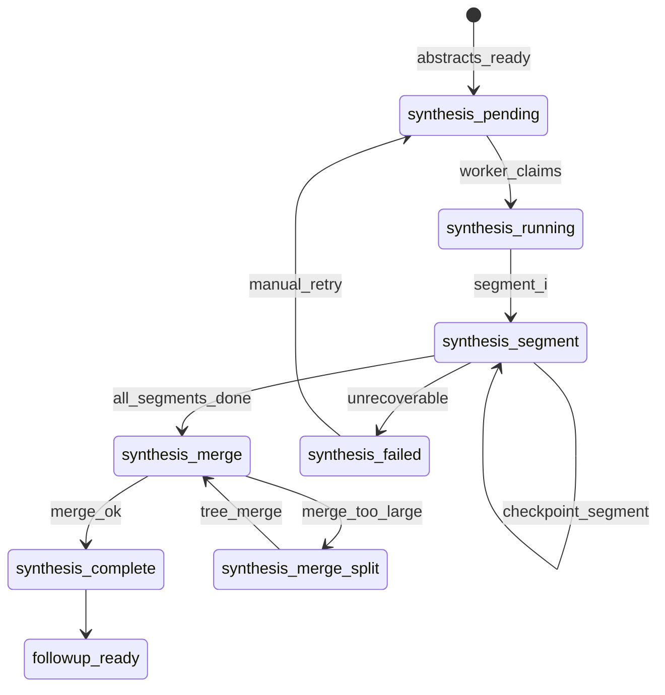
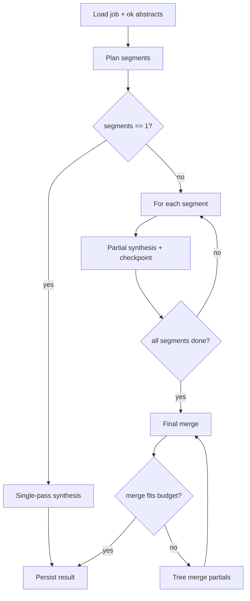

# Phase 5: Durable Server-Side Synthesis — Design Specification

**Status:** Design only (no implementation)  
**Prerequisites:** Phases 1–4 persist job metadata, tract/context, and per-document abstracts on the server with stable ordering and failure records.  
**Reference implementation:** Client `hierarchicalSynthesis` / `buildSynthesisChunks` / `synthesizeSplitAndMerge` in `public/index.html` (to be lifted server-side with durability).

---

## 1. Goals and non-goals

### Goals

- Turn a **complete or partial** set of saved abstracts into one **final title opinion** inside a durable job pipeline.
- Support **large runs** (hundreds of documents) via hierarchical segments + final merge.
- **Resume** after segment failure, timeout, or worker crash without re-abstracting.
- Persist **auditable artifacts**: segment summaries, warnings, token/cost metadata, failed documents.
- Enable **follow-up Q&A** against the job without shipping full conversation history or all abstracts on every turn.

### Non-goals (phase 5)

- Re-running abstraction (owned by earlier phases).
- Structured parsing of title opinion into typed fields (remains markdown prose; optional future phase).
- Incremental merge when new documents are added mid-job (full re-synthesis is acceptable v1; see risks).

---

## 2. Job state machine (synthesis phase)



| Job field | Values |
|-----------|--------|
| `phase` | `abstraction` → `synthesis` → `complete` \| `failed` |
| `synthesis.status` | `pending` \| `running` \| `merging` \| `complete` \| `failed` \| `partial` |
| `synthesis.currentStep` | `segment` \| `merge` \| `merge_tree` |

**Entry condition:** `abstraction.status === 'complete'` OR `abstraction.status === 'partial'` with at least one `abstract.status === 'ok'`.

**Exit success:** `synthesis.status === 'complete'` and `result.finalTitleOpinion` non-empty.

**Exit partial:** Some segments or documents failed, but merge produced an opinion with explicit qualifications (user may still use with caution).

---

## 3. Input structure

### 3.1 Canonical abstract list

Synthesis reads **only** from durable storage, not from the client payload.

```typescript
// Logical input to synthesis planner (not sent to model as one blob)
interface SynthesisInput {
  jobId: string;
  tract?: string;
  additionalContext?: string;
  documents: OrderedAbstract[];  // see ordering rules
  failedDocuments: FailedDocumentRef[];
  grouping: DocumentGroup[];     // metadata for prompts/warnings
}

interface OrderedAbstract {
  sequenceIndex: number;       // 0-based, stable for job lifetime
  documentId: string;          // durable id
  filename: string;            // display name (may include "pp X-Y")
  abstract: string;            // markdown/text from abstraction phase
  status: 'ok';
  sourceDocumentId?: string;   // same PDF before page-split
  pageRange?: [number, number];
  splitFrom?: string;          // original filename if split
  abstractedAt: string;        // ISO timestamp
  model: string;
  tokenUsage?: TokenUsage;
}

interface FailedDocumentRef {
  sequenceIndex: number;
  documentId: string;
  filename: string;
  status: 'failed' | 'skipped' | 'missing';
  errorCode?: string;          // e.g. TIMEOUT, PAYLOAD_TOO_LARGE, PARSE_ERROR
  errorMessage?: string;
  retryable: boolean;
}

interface DocumentGroup {
  sourceDocumentId: string;
  memberDocumentIds: string[];
  label?: string;
}
```

### 3.2 Ordering rules

| Rule | Behavior |
|------|----------|
| **Primary order** | `sequenceIndex` ascending = **original user upload order** at job creation (including “add more documents” as append with new indices). |
| **Page-range chunks** | Multiple entries with same `sourceDocumentId` stay in **page order** (`pageRange[0]` ascending); if ranges overlap or gap, emit `warnings` but do not reorder. |
| **Grouped documents** | `DocumentGroup` is informational: `{ sourceDocumentId, memberDocumentIds[], label }`. Segment prompts note “consecutive parts of same source PDF” (mirrors client `buildAbstractMessages` hint). |
| **Failed/missing** | **Excluded** from segment inputs; listed in `failedDocuments` and referenced in merge preamble + `warnings`. |
| **Empty abstract** | Treated as failed (`status !== 'ok'`); never passed to model. |

**Planner invariant:** Segment boundaries only split between **adjacent** `sequenceIndex` values that both have `status === 'ok'`. Never merge failed docs into a segment silently.

### 3.3 Building the in-memory list for chunking

```
orderedOk = documents.filter(d => d.status === 'ok').sort(by sequenceIndex)
chunks = buildSynthesisChunks(orderedOk, tract, context)  // byte + count aware
```

`buildSynthesisChunks` logic (ported from client):

- Greedy pack abstracts into chunks until `length >= SYNTHESIS_CHUNK_SIZE (50)` **OR** estimated request bytes exceed `REQUEST_ENVELOPE_SAFE_BYTES` (~3.9 MB).
- Start new chunk when either threshold hit.

Preamble for each segment includes:

- Global doc count, segment doc range (`start`–`end` of **original sequence indices**), tract, context.
- Explicit note: “Documents N, M failed abstraction and are omitted; gaps may exist.”

---

## 4. Synthesis workflow

### 4.1 High-level flow



### 4.2 Steps (durable)

| Step | `synthesis.currentStep` | Model | System prompt | Output artifact |
|------|-------------------------|-------|---------------|-----------------|
| Plan | — | — | — | `synthesis.plan.segments[]` |
| Segment *i* | `segment` | Sonnet 4.6 | `PARTIAL_SYNTHESIS_PROMPT` | `segmentSummaries[i]` checkpoint |
| Final merge | `merge` | Sonnet 4.6 | `SYNTHESIS_PROMPT` | `finalTitleOpinion` |
| Tree merge (fallback) | `merge_tree` | Sonnet 4.6 | `PARTIAL` then `SYNTHESIS` | intermediate + final |

**Single-pass:** If planner yields one chunk, call full `SYNTHESIS_PROMPT` once (no partial table in output).

**Segment pass:** Same as client `hierarchicalSynthesis` — partial chain, fractional math, defects; **no** final ownership table.

**Merge pass:** Segment summaries treated as pseudo-abstracts (`filename: "Segment k (Documents a–b)"`).

### 4.3 Dynamic request-size budgeting

Reuse client constants (configurable via env):

| Constant | Default | Use |
|----------|---------|-----|
| `REQUEST_ENVELOPE_SAFE_BYTES` | 3_900_000 | Hard planning cap for synthesis messages |
| `REQUEST_OVERHEAD_BYTES` | 350_000 | JSON/metadata reserve |
| `SYNTHESIS_CHUNK_SIZE` | 50 | Max docs per segment before byte check |
| `SYNTHESIS_MAX_TOKENS` | 8000 | Cap per call |
| `VERCEL_FUNCTION_TIMEOUT_MS` | ~45–52s | Segment timeout policy |

**`estimateRequestBytes(model, max_tokens, system, messages)`** runs before every LLM call. If over budget:

1. At **plan** time: shrink chunk (remove last abstract from chunk, start new chunk).
2. At **run** time (413/timeout): **segment-only** binary split (see retries).

Optional enhancement: subtract **already-completed segment summary sizes** from merge budget when planning final merge; if merge still too large, pre-plan a **merge tree** (binary reduction of segment summaries).

### 4.4 Segment size logic (summary)

```
for each abstract in orderedOk:
  candidate = current_chunk + abstract
  if current_chunk non-empty AND (
       len(current_chunk) >= 50 OR
       bytes(buildAbstractInput(candidate)) > SAFE_BYTES
     ):
    flush current_chunk
    start new chunk with abstract
  else:
    current_chunk = candidate
```

Each chunk records `startSequenceIndex`, `endSequenceIndex`, `documentIds[]`, `estimatedBytes`.

### 4.5 Checkpointing

After **each successful segment**, atomically persist:

```typescript
interface SynthesisCheckpoint {
  jobId: string;
  planId: string;              // hash of ordered doc ids + tract + context
  completedSegmentCount: number;
  segmentSummaries: SegmentSummary[];  // append-only
  updatedAt: string;
}
```

**Resume:**

- Reload checkpoint; skip segments `0..completedSegmentCount-1`.
- Re-run only missing/failed segments.
- If `planId` changed (document set changed), invalidate checkpoint and replan.

**Idempotency:** Segment worker uses `segmentIndex` + `jobId` as idempotency key; duplicate writes overwrite same `segmentSummaries[i]` only if content hash matches or attempt version increments.

---

## 5. Segment schema

```typescript
interface SynthesisPlan {
  planId: string;
  createdAt: string;
  totalDocuments: number;        // ok count
  totalSegments: number;
  segments: SynthesisSegment[];
  estimatedRequestCount: number;
  estimatedBytesMax: number;
}

interface SynthesisSegment {
  segmentIndex: number;          // 0-based
  startSequenceIndex: number;
  endSequenceIndex: number;
  documentIds: string[];
  filenames: string[];
  estimatedBytes: number;
  status: 'pending' | 'running' | 'complete' | 'failed';
  attempt: number;
  lastError?: string;
}

interface SegmentSummary {
  segmentIndex: number;
  startSequenceIndex: number;
  endSequenceIndex: number;
  summary: string;               // model output markdown
  generatedAt: string;
  model: string;
  tokenUsage: TokenUsage;
  attempt: number;
  warnings: string[];            // e.g. "segment split due to timeout"
}

interface TokenUsage {
  inputTokens: number;
  outputTokens: number;
  cacheReadTokens?: number;
  cacheWriteTokens?: number;
  byPhase?: {
    segment?: TokenUsage;
    merge?: TokenUsage;
    mergeTree?: TokenUsage;
  };
}
```

---

## 6. Final result schema

Stored on job (or `job_results` table) when synthesis completes or partial-completes:

```typescript
interface SynthesisResult {
  jobId: string;
  status: 'complete' | 'partial' | 'failed';

  finalTitleOpinion: string;     // full markdown; empty if failed
  segmentSummaries: SegmentSummary[];

  warnings: string[];            // human-readable bullets
  failedDocuments: FailedDocumentRef[];

  generatedAt: string;           // ISO — merge completion time
  model: string;                 // synthesis/merge model (e.g. claude-sonnet-4-6)

  tokenUsage: TokenUsage;        // rolled up
  costEstimateUsd?: number;      // from list prices × tokens

  plan: SynthesisPlan;
  synthesisDurationMs?: number;
}
```

**`warnings` examples:**

- “3 documents failed abstraction and were excluded from synthesis.”
- “Segment 2 required binary split after timeout.”
- “Final merge used truncated segment 4 summary (retry exhausted).”
- “Chain gap between doc #45 and #47 — no abstract for #46.”

**`partial` status:** Merge succeeded but ≥1 segment failed OR ≥1 abstract failed; opinion must include qualification section listing omissions.

---

## 7. Retry and fallback behavior

### 7.1 Segment timeout / 504 / upstream error

| Attempt | Action |
|---------|--------|
| 1 | Retry same segment (exponential backoff, max 3). |
| 2 | **Binary split** segment abstract list (same as `synthesizeSplitAndMerge`); run partial on each half; **combine** half-summaries into one segment summary via small merge call. |
| 3 | Mark segment `failed`; continue other segments if policy `continue_on_segment_failure` (default true for partial jobs). |

Checkpoint after each successful sub-half merge.

### 7.2 Request too large (413 / envelope)

| Scope | Action |
|-------|--------|
| Segment | Binary split abstracts; partial prompts; merge halves. |
| Final merge | If `segmentSummaries` as pseudo-abstracts exceed budget: **merge tree** — pair segments, partial-merge pairs, repeat until one summary, then final `SYNTHESIS_PROMPT`. |
| Single giant segment | Should not happen if planner correct; planner must split by bytes before run. |

### 7.3 Some document abstracts failed

- Synthesis runs on **ok** subset only.
- `failedDocuments` copied from abstraction phase + any synthesis-time exclusions.
- Merge preamble: “N documents unavailable; do not infer facts for missing instruments.”
- Final opinion **must** list missing instruments under Opinion Qualifications / Gaps.

### 7.4 Malformed or incomplete model output

**Validation (lightweight, v1):**

- Non-empty string, min length threshold (e.g. 500 chars for merge, 200 for segment).
- Required section headers for **final** merge only: `CHAIN OF TITLE`, `FINAL OWNERSHIP`, `OPINION QUALIFICATIONS` (case-insensitive).
- Segment: require `CHAIN` or `ownership flow` keyword; no final ownership table required.

| Outcome | Action |
|---------|--------|
| Fail validation | Retry once with repair user message: “Previous response incomplete; include all required sections.” |
| Still fail | Mark step failed; if segment, try binary split; if final merge, try tree merge or return `partial` with best-effort stored output + warning. |

Never silently discard partial text — store in `segmentSummaries[i].summary` with `warnings` even if validation fails (for debugging).

### 7.5 Worker crash mid-job

- Job `synthesis.status` stays `running` with lease TTL; stale lease → reclaim.
- Resume from last `completedSegmentCount` checkpoint.
- In-flight segment reset to `pending` if no checkpoint for that index.

---

## 8. API / worker interfaces (conceptual)

| Endpoint / worker | Purpose |
|-------------------|---------|
| `POST /api/jobs/:id/synthesis/start` | Enqueue synthesis (idempotent) |
| `GET /api/jobs/:id` | Poll phase, progress, warnings |
| `GET /api/jobs/:id/result` | Final opinion + metadata |
| `POST /api/jobs/:id/followup` | Ask question (see §9) |
| Background: `synthesis-worker` | Claims jobs, runs plan/segments/merge |

Progress events (SSE or poll):

```json
{
  "phase": "synthesis",
  "step": "segment",
  "segmentIndex": 2,
  "totalSegments": 5,
  "message": "Synthesizing segment 3 of 5 (documents 101–150)..."
}
```

---

## 9. Follow-up architecture (durable jobs)

### 9.1 Principles

- **Primary context:** latest `finalTitleOpinion` for `jobId` (not full abstract bundle).
- **Do not** attach original multi-megabyte `analysis-input` or all abstracts to each follow-up.
- **Optional retrieval:** If the model needs source detail, worker fetches **selected** abstracts by `documentId` or filename match (RAG-lite: keyword / doc number in question).

### 9.2 Request shape

```typescript
interface FollowupRequest {
  jobId: string;
  question: string;
  retrieveAbstracts?: 'auto' | 'none' | { documentIds: string[] };
}

interface FollowupContext {
  titleOpinion: string;          // full or truncated to fit budget
  recentTurns: FollowupTurn[]; // capped
  retrievedAbstracts?: { filename: string; abstract: string }[];
}
```

### 9.3 Context budgeting (port from `buildFollowupMessages`)

1. Include full title opinion + up to `FOLLOWUP_HISTORY_TURNS = 4` prior Q/A pairs (8 messages).
2. If over `REQUEST_ENVELOPE_SAFE_BYTES`, drop oldest turns.
3. Then truncate title opinion to 75% steps until fits.
4. If still over, return structured error asking user to narrow question.

**`retrieveAbstracts: 'auto'`:** Parse question for document numbers / filenames; load at most **3** abstracts; append short preamble “Source excerpts for verification only.”

### 9.4 Q&A history storage

| Approach | Recommendation |
|----------|----------------|
| **Store on job** | Yes — append-only `followups[]` on job record (durable, auditable). |
| **Client-only** | No — breaks multi-device and support replay. |

```typescript
interface FollowupTurn {
  id: string;
  askedAt: string;
  question: string;
  answer: string;
  model: string;
  tokenUsage: TokenUsage;
  retrievedDocumentIds?: string[];
}
```

Follow-up calls use `phase: 'followup'`, same `SYNTHESIS_PROMPT` system prompt, `SYNTHESIS_MODEL`.

**Add-more documents (later):** New abstraction append → invalidate synthesis checkpoint → full re-synthesis job (v1). Follow-ups after re-run reference new `generatedAt` opinion.

---

## 10. Test plan

### 10.1 Unit tests

| Area | Cases |
|------|-------|
| Ordering | Upload order preserved; page splits ordered by `pageRange`; failed docs excluded from chunks |
| `buildSynthesisChunks` | 50-doc cap; byte cap splits mid-list; single huge abstract gets its own chunk |
| Planner | `planId` changes when document set changes; checkpoint invalidation |
| Budget | `estimateRequestBytes` matches serialized payload; merge tree triggers when segment count high |

### 10.2 Integration tests

| Scenario | Expected |
|----------|----------|
| 10 ok abstracts | Single-pass synthesis, no segments |
| 120 ok abstracts | 3 segments + merge; all checkpoints written |
| 1 failed + 9 ok | `partial`, warning lists failed doc, opinion mentions gap |
| Segment mock timeout | Retry then binary split; checkpoint after recovery |
| Merge payload too large | Tree merge completes; token rollup correct |
| Malformed LLM response | Repair retry; then fail with stored partial |
| Resume | Kill worker after segment 2; restart completes 3..N without re-call segment 1–2 |
| Follow-up | Only title opinion in payload; history capped; auto-retrieve pulls named doc |

### 10.3 Regression parity with client

Port existing `test/reliability.test.js` scenarios:

- Synthesis envelope split guardrails
- Follow-up context exclusion of raw analysis-input
- Constants alignment (`SYNTHESIS_CHUNK_SIZE`, safe bytes)

### 10.4 Manual / QA title scenarios

- Multi-probate chain with heirship gaps
- Same PDF split across 5 page-range abstracts (group hint in prompt)
- Run with intentional abstraction failure on middle deed — verify opinion does not invent grantor

---

## 11. Risks — title and mineral ownership accuracy

| Risk | Cause | Mitigation in design |
|------|--------|----------------------|
| **Lost instruments** | Failed abstracts omitted from segments | Explicit `failedDocuments` + mandatory gap language in merge; `partial` status |
| **Page-split discontinuity** | Chunks abstracted separately | Group metadata in prompts; warn on non-contiguous page ranges |
| **Segment boundary splits chain** | Chronology spans segment edge | Partial prompts require end-of-segment running balance; merge prompt requires reconciling balances across segments |
| **Double counting** | Tree merge / binary split duplicates facts | Partial prompts: “do not restate final ownership”; merge: “deduplicate, one table” |
| **Fraction math drift** | Each segment recalculates independently | Require “running fractional balance at end of segment” in partial; merge validates consistency |
| **Hallucinated gap-fill** | Model invents bridge deeds | System prompts: facts-only; validation flags missing `#N` in sequence |
| **Over-truncated follow-up** | Title opinion truncated for bytes | Warn user; offer retrieveAbstracts for specific docs |
| **Stale opinion after add-docs** | Partial checkpoint invalidation | Bump `result.version`; follow-ups pin `generatedAt` |
| **False completeness** | `complete` with failed segments | Only `complete` when all segments ok; else `partial` |

---

## 12. Migration notes from current client

| Client behavior | Server phase 5 |
|-----------------|----------------|
| In-memory `documentAbstracts` | Load from durable job store |
| `hierarchicalSynthesis` | Worker with checkpoints |
| `synthesizeSplitAndMerge` on error | Per-segment + merge-tree fallback |
| No synthesis checkpoint | `SynthesisCheckpoint` after each segment |
| `conversationHistory` with bulky `analysis-input` | Store slim `SynthesisResult`; follow-ups use opinion only |
| `localStorage` abstraction checkpoint | Already superseded by server abstraction |

---

## 13. Open decisions (for implementation phase)

1. **Storage backend:** Blob per job vs relational `jobs` + `job_documents` + `job_synthesis_segments`.
2. **Lease TTL** and max job runtime for 400-document runs.
3. Whether `partial` synthesis is allowed to ship to end users without explicit UI acknowledgment.
4. **Cost estimate** formula source (static price table vs API usage headers).
5. **Structured validation** of ownership table (future) vs markdown header checks (v1).
