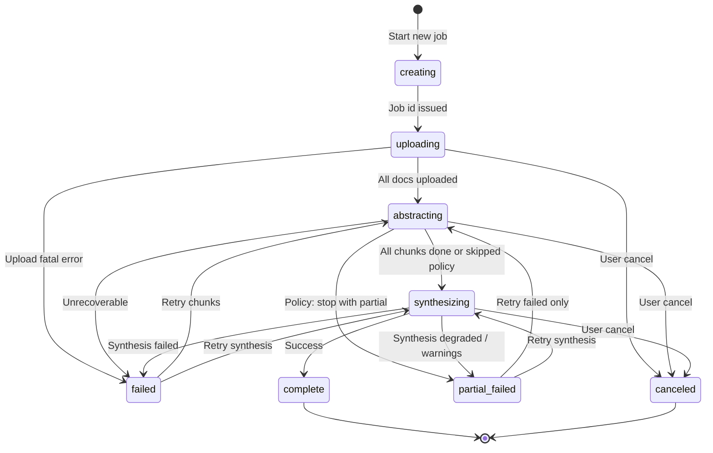

# Phase 6: Durable Job UI — Resume, Progress, and History

**Status:** Design specification (no implementation in this document)  
**Scope:** Frontend UX and architecture for server-backed durable title-analysis jobs  
**App context:** Single-page app in `public/index.html`; client-orchestrated runs today with ephemeral progress and optional `localStorage` abstraction checkpoints.

---

## 1. Goals and principles

| Goal | Design implication |
|------|------------------|
| Upload many documents, leave, return | Stable **job URL** + server state; browser is a viewer/controller |
| See accurate progress | Poll (or SSE later) **server counters**, not client guesses |
| Recover from failures | Explicit **retry actions** per failure class |
| View finished work | **Results** loaded from job record, not only in-memory `conversationHistory` |
| Minimal rewrite | Extend `index.html` with a **view router** and job modules; no React/Vite unless later |

**Source of truth:** Server job record. **Browser:** cache for UX (recent jobs, optimistic UI, upload queue).

---

## 2. Job lifecycle UI

### 2.1 Canonical statuses (align with backend)

| Status | User-facing label | Primary screen |
|--------|-------------------|----------------|
| `creating` | Preparing job… | Create wizard (step 1) |
| `uploading` | Uploading documents… | Create wizard (step 2) |
| `abstracting` | Reading documents… | Job status (active) |
| `synthesizing` | Building chain of title… | Job status (active) |
| `complete` | Analysis complete | Job status (results) |
| `failed` | Job failed | Job status (error + recovery) |
| `partial_failed` | Finished with errors | Job status (results + warnings) |
| `canceled` | Canceled | Job status (terminal) |

**Sub-phases** (for progress copy, not separate top-level status): `upload` within `uploading`; `abstract` / `synthesis` map to existing client `phase` concepts.

### 2.2 State machine (UI)



### 2.3 Screen map

| Screen | Route (proposed) | When shown |
|--------|------------------|------------|
| **Home / New job** | `/` or `#/` | Default; tract + upload + “Start job” |
| **Job status** | `#/job/{jobId}` | After create, bookmark, history click |
| **Job history** | `#/jobs` | Optional sidebar/panel |
| **Legacy inline run** | Hidden behind flag | Migration only |

**Recommendation:** Hash routes (`#/job/abc123`) in the same `index.html` — no `vercel.json` rewrites, works with static `public/`.

### 2.4 Per-status UI behavior

#### `creating`

- Disable “Start” until tract/context validated (optional).
- Spinner on primary button: “Creating job…”
- On success: navigate to `#/job/{id}` and begin upload phase.

#### `uploading`

- **Upload queue** per document: `queued | uploading | uploaded | failed`.
- Show **X of Y uploaded** and bytes if useful.
- Allow **add more files** before marking upload complete (if backend supports).
- Primary CTA when all required uploads succeed: **“Start processing”** (or auto-start if product prefers).
- **Cancel job** available (confirm dialog).

#### `abstracting`

- Reuse existing **progress card** (`#progressSection` pattern).
- Phase label: “Reading documents…”
- List: per-document or summary row (≤50 docs: per-file list; >50: summary + expandable failures).
- **Leave page** banner: “You can close this tab. Reopen this link to check progress.”

#### `synthesizing`

- Same progress card; phase label: “Synthesizing chain of title…”
- Show synthesis **segment** progress if hierarchical (`step 2 of 5`).

#### `complete`

- Hide progress card; show **results** (`#results` + `#followupSection`).
- Actions: Download PDF, Add more documents (creates **child job** or **job revision** — see open questions), copy job link.

#### `failed`

- Error card (existing `.error-msg` style) with **failure class**: upload / abstraction / synthesis / system.
- Show **retry count** and last error message (sanitized).
- Recovery actions (section 5).

#### `partial_failed`

- **Warning banner** above results: “N documents could not be read. The opinion may be incomplete.”
- Results still visible if `result.summary` exists.
- List failed documents with links to retry/remove/replace.

#### `canceled`

- Neutral terminal state: “This job was canceled.”
- Actions: **Start new job** (prefill tract from canceled job), **View history**.

---

## 3. Job status page layout

Single **Job Status** view composes these blocks (top → bottom):

```
┌─────────────────────────────────────────────────────────────┐
│ Header: Mineral Ownership Builder (unchanged)               │
├─────────────────────────────────────────────────────────────┤
│ Job header card                                             │
│  • Title: tract description or "Job {shortId}"              │
│  • Status badge (color by status)                           │
│  • Created / updated timestamps                             │
│  • Link: Copy job URL · Open in new tab                     │
├─────────────────────────────────────────────────────────────┤
│ Progress summary (hidden when complete/canceled)            │
│  • Status line (human phase)                                │
│  • Progress bar (server progressPercent or derived)         │
│  • ETA line (if etaSeconds present)                         │
│  • Counters: docs · chunks · failed · retries             │
├─────────────────────────────────────────────────────────────┤
│ Phase stepper (optional compact)                            │
│  Upload ✓ → Abstract ● → Synthesize ○                       │
├─────────────────────────────────────────────────────────────┤
│ Detail panel (tabs or accordion)                            │
│  [Documents] [Activity] [Errors]                            │
│  • Document table: name, status, chunk progress, actions    │
│  • Activity: last 20 events (poll merges into log)          │
│  • Errors: failed doc names + last error per item           │
├─────────────────────────────────────────────────────────────┤
│ Primary actions (contextual by status)                      │
│  Cancel · Retry failed · Retry synthesis · Skip & synth…    │
├─────────────────────────────────────────────────────────────┤
│ Results / follow-up (complete | partial_failed w/ result)   │
│  (existing results + followup UI)                           │
└─────────────────────────────────────────────────────────────┘
```

### 3.1 Progress display (required fields)

| Field | UI placement |
|-------|----------------|
| `documents.total` | “47 documents” |
| `documents.completed` | “42 read” |
| `documents.failed` | “3 failed” (red if >0) |
| `chunks.total` / `chunks.completed` / `chunks.failed` | Secondary line for bulk |
| `phase` | Status line + stepper |
| `progressPercent` | Bar fill (0–100, cap at 99 until terminal) |
| `etaSeconds` | `#progressEta` — hide if null |
| `retryCount` | Subtext: automatic retries (job-level) + per-document if provided |
| `failedDocuments[]` | Errors tab + inline chips |

**Progress bar policy:** Prefer server `progressPercent`. Fallback (only if omitted): weight abstraction 70% / synthesis 30% from chunk counts.

**List density:** Per-document list if ≤50 documents; otherwise summary row + “Show all documents” expander (matches current app behavior).

### 3.2 Status badge colors

- Active phases: `#b8631e`
- Complete: `#4a7c4e`
- Failed: `#d97755` / `#fce8e0`
- Partial: amber (`.verify-note` style)
- Canceled: `#8a6f4a` muted

---

## 4. Resume behavior

### 4.1 Job URL format

```
https://{deployment-host}/#/job/{jobId}
```

- **`jobId`:** opaque, unguessable (e.g. `job_` + 22+ char base62/UUID). Not sequential integers.
- Do not put password in URLs; keep `sessionStorage` only.
- **Short link display:** first 8 chars of id in history list.

### 4.2 Reload behavior

On `DOMContentLoaded` + hash change:

1. Parse `#/job/{id}`.
2. If no password in session → existing password gate → then load job.
3. `GET /api/jobs/{id}` → render view for `status`.
4. If `uploading` and local queue has pending files → resume uploads (IndexedDB queue).
5. Start polling if status is non-terminal.

**Deep link without auth:** 401 → password gate → retry fetch.

**Unknown job:** 404 in-app: “Job not found. It may have expired or the link is wrong.”

### 4.3 Polling behavior

| Job status | Poll? |
|------------|-------|
| `creating`, `uploading`, `abstracting`, `synthesizing` | Yes |
| `complete`, `failed`, `partial_failed`, `canceled` | No |

**Adaptive interval (client):**

- Start **2s** after last change.
- If `updatedAt` unchanged for 3 consecutive polls → **5s**.
- After 2 min unchanged → **10s**.
- After 10 min unchanged → **30s** (cap).
- On status/percent/event change → reset to **2s**.
- **Page hidden:** multiply interval ×3 (min 10s).
- **Tab visible again:** immediate poll + reset to 2s.

Use `If-None-Match` / `ETag` on `GET /api/jobs/{id}` when supported.

**Backoff on errors:** 429/503 → exponential backoff 5s → 60s; show “Connection issue — retrying…”

### 4.4 Stale job handling

| Condition | UI |
|-----------|-----|
| No `updatedAt` change for **30 min** while active | Banner + **Refresh** |
| No change for **24h** | Stale; offer **Cancel** + admin note |
| `expiresAt` passed | Read-only; hide retry; keep results if available |
| Client clock skew | Relative times from server `updatedAt` |

### 4.5 Browser local state vs server state

| Data | Where | Purpose |
|------|--------|---------|
| Job status, progress, results | **Server** | Authoritative |
| `app_password` | `sessionStorage` | Auth header (existing) |
| Recent job ids (last 20) | `localStorage` | History sidebar |
| Upload queue (blobs) | **IndexedDB** | Resume interrupted uploads |
| Draft new job | `sessionStorage` optional | UX convenience |
| Abstraction checkpoints | `localStorage` | Deprecate when jobs ship |

**Conflict rule:** Server wins on poll. Local upload queue only drives upload phase until server marks document uploaded.

**Migration:** Feature flag `USE_DURABLE_JOBS`. When on, “Build Chain of Title” creates a job instead of inline `analyze()`.

---

## 5. Retry UI

### 5.1 Action matrix

| User action | When enabled | API (expected) |
|-------------|--------------|----------------|
| **Retry failed chunks** | `failed` or `partial_failed` with failed chunks | `POST .../actions` `{ type: "retry_failed_chunks" }` |
| **Retry synthesis** | Synthesis failed | `{ type: "retry_synthesis" }` |
| **Skip failed & synthesize** | Partial abstraction success | `{ type: "synthesize_with_warnings", skipDocumentIds }` |
| **Remove document** | Failed or stuck doc | `DELETE .../documents/{docId}` or action |
| **Upload replacement** | Per failed doc | `POST .../documents` + `replacesDocumentId` |
| **Retry entire job** | Terminal failure | `{ type: "retry_job" }` or new job |
| **Cancel job** | Non-terminal | `{ type: "cancel" }` |

### 5.2 Document row actions

Per failed document: **Retry**, **Replace file**, **Remove**, expand **error detail**.

### 5.3 Automatic vs manual retries

- Show job-level `retryCount` from workflow.
- Disable manual retry while `actionInFlight`.
- Optional `userRetryCount` for support.

### 5.4 Skip-failed synthesis

1. Modal lists skipped filenames.
2. Checkbox: “I understand the opinion may be incomplete.”
3. Warnings in results + PDF footer.

---

## 6. Job history

### 6.1 Visibility

**Yes** — lightweight **Recent jobs** panel (required for return-later without bookmarking).

**v1:** Browser-only list (`localStorage`) of job ids created/opened on this device.

**v2 (optional):** `GET /api/jobs?scope=session` when backend has session identity.

No global server job list without per-user auth (shared `APP_PASSWORD` deployments).

### 6.2 History row fields

- Primary: tract description or “Untitled tract”
- Secondary: `{shortId}` · relative time · status badge
- Tertiary: document count · duration if complete
- Sort: `lastViewedAt` desc

### 6.3 Privacy

| Risk | Mitigation |
|------|------------|
| Job URL is capability token | Long random `jobId`; optional `jobSecret` later |
| Shared password | Document: anyone with password + id can open; educate admins |
| History in localStorage | Ids + labels only, not file content |
| PII in results | `Cache-Control: no-store`; no CDN cache |
| Expired jobs | 404; prune from recent list |

### 6.4 Auth

- Continue `x-app-password` on all job APIs.
- 401 on job fetch → password gate → retry.
- No password in job URLs.

---

## 7. Integration with `public/index.html`

### 7.1 Smallest practical path

Add inline script sections in the same file (no bundler):

- `job-router.js` — `parseHash()`, `navigate()`, `onRoute()`
- `job-api.js` — `fetchJob`, `createJob`, `pollJob`, `postAction`, `uploadDocument`
- `job-views.js` — `renderJobStatus()`, `renderHistory()`, `bindJobActions()`

**HTML:**

- `#view-home` — current upload card
- `#view-job` — status layout
- `#view-history` — recent jobs panel
- Reuse `#progressSection`, `#results`, `#followupSection` inside job view

### 7.2 Reuse unchanged

- CSS: `.progress-card`, `.pi`, `.analysis-card`, buttons
- `updateProgress()`, ETA formatters (fed from server in job mode)
- `renderResults()`, `md()`, PDF download, password gate
- `ingestUploadedFiles`, PDF split — run before upload to job storage

### 7.3 Retire gradually (job mode)

- Client `requestSlotQueue` throttling
- `localStorage` abstraction checkpoints
- “Keep tab open” copy → job link messaging

### 7.4 Not v1

- SSE/WebSocket
- Separate `job.html`
- Next.js / full SPA rewrite

---

## 8. Frontend data model

```typescript
type JobStatus =
  | 'creating' | 'uploading' | 'abstracting' | 'synthesizing'
  | 'complete' | 'failed' | 'partial_failed' | 'canceled';

type JobPhase = 'upload' | 'abstract' | 'synthesis' | null;

interface JobSummary {
  id: string;
  status: JobStatus;
  phase: JobPhase;
  tractDescription?: string;
  contextNotes?: string;
  createdAt: string;
  updatedAt: string;
  expiresAt?: string;
  progressPercent: number;
  etaSeconds?: number | null;
  retryCount: number;
  documents: { total: number; completed: number; failed: number };
  chunks: { total: number; completed: number; failed: number };
  failedDocuments: Array<{
    id: string;
    name: string;
    error?: string;
    retryable: boolean;
  }>;
  warnings?: string[];
  result?: {
    titleOpinionMarkdown: string;
    conversationSeed?: unknown;
  };
}

interface JobListEntry {
  id: string;
  tractDescription?: string;
  status: JobStatus;
  documentCount: number;
  lastViewedAt: number;
}
```

**Client store:**

```javascript
const jobStore = {
  current: null,
  pollTimer: null,
  pollIntervalMs: 2000,
  actionInFlight: false,
  etag: null,
};
```

---

## 9. API dependencies

| Method | Endpoint | UI use |
|--------|----------|--------|
| POST | `/api/jobs` | Create job |
| POST | `/api/jobs/{id}/documents` | Upload / presigned confirm |
| POST | `/api/jobs/{id}/documents/complete` | Start processing |
| GET | `/api/jobs/{id}` | Poll status + results |
| POST | `/api/jobs/{id}/actions` | cancel, retry_*, synthesize_with_warnings |
| DELETE | `/api/jobs/{id}/documents/{docId}` | Remove document |
| POST | `/api/jobs/{id}/followup` | Follow-up (optional v1) |
| GET | `/api/jobs` | Optional authenticated list |

**Headers:** `Content-Type`, `x-app-password`, `x-request-id`.

**Upload:** Prefer presigned Blob URLs to avoid 4.5 MB limits on `analyze.js`.

**Existing:** `/api/analyze` until follow-up migration.

---

## 10. Implementation order (later phase)

1. Hash router + job view shell
2. `GET /api/jobs/{id}` + polling
3. Create + upload flow
4. Server-driven progress UI
5. Terminal states + results hydration
6. Retry actions + modals
7. Recent jobs (`localStorage`)
8. Feature flag; deprecate inline `analyze()`
9. README: job links vs “keep tab open”

---

## 11. Risks and open questions

### Risks

| Risk | Mitigation |
|------|------------|
| Shared password = weak job ACL | Long ids; admin docs; future per-user auth |
| `index.html` size | Logical sections; split files later without framework |
| IndexedDB unavailable | Warn before leaving during upload |
| Polling cost | ETag, adaptive intervals, visibility backoff |
| Duplicate retries | `actionInFlight`; idempotent action tokens |
| Follow-up on partial results | Disable or warn until `complete` |

### Open questions

1. **Add more documents after complete:** new linked job vs same job re-abstracting?
2. **Auto-start** after upload vs explicit “Start processing”?
3. **Upload during `abstracting`:** allowed or locked?
4. **Job retention TTL** and expired-job UX?
5. **Follow-up:** job-scoped API vs stateless `analyze` with embedded opinion?
6. **Server `progressPercent` formula?**
7. **History:** flat list vs parent/child jobs?
8. **Feature flag default** and parallel modes duration?
9. **Does polling count** toward `ANALYZE_RATE_LIMIT_MAX`?
10. **CSP `connect-src`** for Blob upload domains?

---

## 12. Summary

Phase 6 adds a **job-centric view** on the existing single-file app: hash routes, server-authoritative progress, adaptive polling, and explicit recovery. Visual patterns stay the same; orchestration moves off the tab. Recent jobs are browser-local initially to match shared-password security, with a path to server-scoped history when real auth exists.
